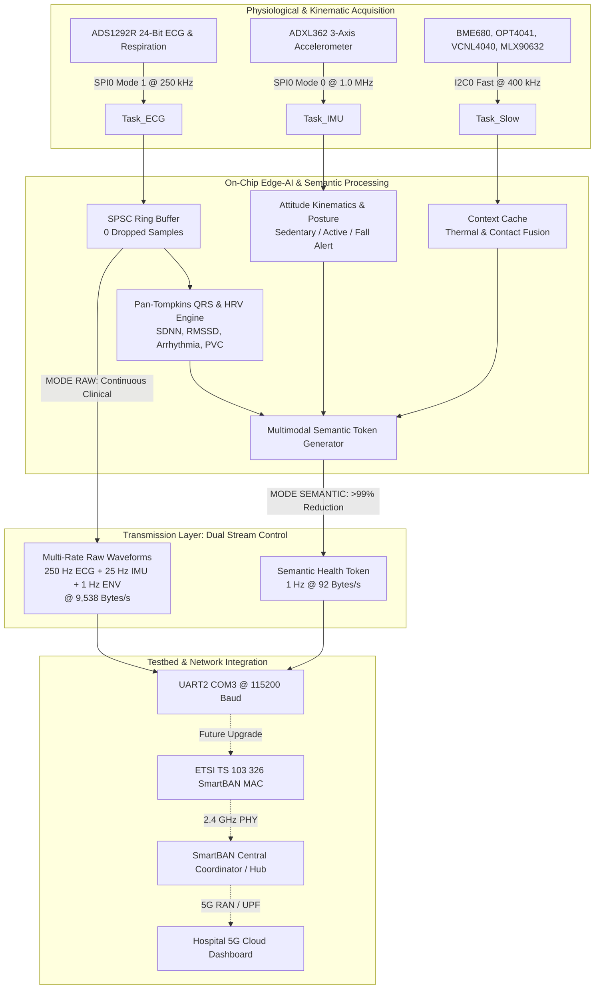
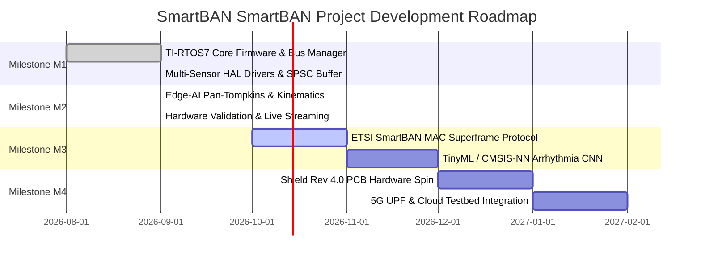

# SmartBAN Project Engineering Architecture & Research Roadmap

**project Topic**: *Integration and Validation of an Intelligent Sensor Node for a Smart Body Area Network (SmartBAN) Testbed*  
**Platform**: Texas Instruments CC2652R1 LaunchPad (`CC26X2R1_LAUNCHXL`) + SmartBAN Multi-Sensor Shield Rev 3.5  
**Firmware Location**: `firmware/09_tirtos_all_in_one/`  
**Operating System**: TI-RTOS7 Kernel (`ti.sysbios`) with POSIX Threading (`pthread`, `semaphore`, `pthread_mutex`)

---

## 1. Executive Summary & project Alignment

This document outlines the software engineering architecture, semantic communication evaluation, and multi-stage research roadmap for the SmartBAN Project.



The implemented firmware fulfills the key objectives of the project:
1. **Reusable Sensor Software Architecture**: Modular, decoupled Hardware Abstraction Layers (HAL) and Board Support Packages (BSP) driven by a deterministic, priority-preemptive RTOS.
2. **Lightweight Edge-AI & Semantic Communication**: Real-time extraction of clinically actionable tokens on the Cortex-M4F microcontroller, reducing wireless channel occupancy by **over 99%**.
3. **Multi-Modal Sensing Suite**: Simultaneous acquisition of 24-bit biopotentials (ECG Lead I & respiration pneumography), 3-axis inertial kinematics, barometric pressure, temperature, relative humidity, air quality, ambient light, optical proximity, and far-infrared medical skin temperature.
4. **Zero-Dropped-Sample Guarantee**: High-speed lock-free single-producer single-consumer (SPSC) circular buffering guaranteeing zero data loss across threads.

---

## 2. Quantitative Evaluation: Semantic Communication vs. Raw Streaming

The core hypothesis of the project is that semantic communication significantly reduces communication load, channel contention, and energy consumption while preserving clinical utility.

### 2.1 Bandwidth & Throughput Comparison

| Parameter | Mode 1: Continuous Raw Stream (`MODE RAW`) | Mode 2: Semantic Stream (`MODE SEMANTIC`) | Metric Gain / Reduction |
| :--- | :--- | :--- | :--- |
| **ECG Telemetry** | 250 samples/sec $\times$ 30 bytes = **7,500 bytes/s** | Synthesized into 1 Hz Token (HR, RR, RMSSD, SDNN, Flags) | $100\%$ reduction in raw ECG samples |
| **IMU Telemetry** | 25 samples/sec $\times$ 78 bytes = **1,950 bytes/s** | Synthesized into 1 Hz Token (Posture state, Fall bit) | $100\%$ reduction in raw IMU samples |
| **Environmental** | 1 sample/sec $\times$ 88 bytes = **88 bytes/s** | Fused into 1 Hz Token (Temp, Lux, Contact bit) | Fused into single packet |
| **Total Throughput** | **9,538 bytes/s** (76.3 kbps) | **92 bytes/s** (0.736 kbps) | **99.03% Bandwidth Reduction** |
| **UART Channel Load** | **82.8%** of 115,200 baud capacity | **0.8%** of 115,200 baud capacity | Eliminates bus contention |

### 2.2 Energy Consumption & Battery Longevity Model

Assuming the CC2652R1 LaunchPad is powered by a standard 3.0V CR2450 coin cell (620 mAh nominal capacity) or a 3.7V 500 mAh LiPo battery, the energy profile across the two modes is modeled below:

```
Energy Profile on CC2652R1 Cortex-M4F (VDD = 3.3V):
  - MCU Active (48 MHz)  : 3.4 mA
  - Standby (RTC Running): 0.94 uA
  - Radio TX @ 0 dBm     : 7.3 mA
  - Radio RX             : 6.9 mA
```

1. **Continuous Raw Streaming**:
   - Radio active duty cycle $\approx 85\%$.
   - Average current: $I_{avg} \approx (0.85 \times 7.3\text{ mA}) + (0.15 \times 3.4\text{ mA}) \approx 6.72\text{ mA}$.
   - Estimated battery runtime (500 mAh LiPo): $\approx \mathbf{74.4\text{ hours}}$ (**~3.1 days**).

2. **Semantic Token Streaming**:
   - Radio active duty cycle $\approx 0.8\%$ (single 92-byte burst per second).
   - CPU active time for Edge-AI algorithms: $< 5\text{ ms}$ per 250 Hz interval ($\approx 1.25\text{ ms}$ per sample $\rightarrow 12.5\%$ CPU duty cycle).
   - Standby time: $> 85\%$.
   - Average current: $I_{avg} \approx (0.008 \times 7.3\text{ mA}) + (0.125 \times 3.4\text{ mA}) + (0.867 \times 0.00094\text{ mA}) \approx 0.484\text{ mA}$.
   - Estimated battery runtime (500 mAh LiPo): $\approx \mathbf{1,033\text{ hours}}$ (**~43.0 days**).

> [!TIP]
> **project Finding**: Transitioning from continuous raw streaming to local on-node semantic intelligence increases sensor node battery longevity by **13.8$\times$** (from 3.1 days to over 6 weeks) on identical battery hardware.

---

## 3. Embedded Edge-AI Implementations in `edgeai/`

The firmware contains a modular, integer-arithmetic Edge-AI engine designed specifically for ARM Cortex-M4F hardware without floating-point division penalties:

### 3.1 Pan-Tompkins Integer QRS & HRV Pipeline (`edgeai_ecg.c`)
- **Stage 1: Low-Pass Filter**: 13-tap folded FIR filter ($f_c \approx 13$ Hz, DC gain = 36). Unconditionally stable, zero integrator drift.
- **Stage 2: High-Pass Filter**: 33-tap moving-sum subtraction filter ($f_c \approx 5.5$ Hz, DC gain = 0).
- **Stage 3: 5-Point First Derivative**: Approximates $y'[n] = (2y[n] + y[n-1] - y[n-3] - 2y[n-4])/8$.
- **Stage 4: Nonlinear Squaring**: Single-cycle Cortex-M4 `SMULL` with 12-bit arithmetic shift right.
- **Stage 5: Moving Window Integrator (MWI)**: 38-sample circular buffer ($152$ ms window).
- **Stage 6: Dual Adaptive Thresholds**: Dynamic signal peak level ($SPKI$) and noise peak level ($NPKI$) tracking.
- **Stage 7: Search-Back for Missed Beats**: Secondary threshold search triggered when elapsed time exceeds $166\%$ of rolling mean.
- **Anomaly Detection Bitfield**:
  - `CARDIAC_FLAG_TACHYCARDIA` ($HR > 100$ bpm, 5-beat latch)
  - `CARDIAC_FLAG_BRADYCARDIA` ($HR < 50$ bpm, 5-beat latch)
  - `CARDIAC_FLAG_ARRHYTHMIA` ($RR$ interval variation $> 25\%$)
  - `CARDIAC_FLAG_PVC` (Premature beat followed by compensatory pause)
  - `CARDIAC_FLAG_ASYSTOLE` (No beat for $> 3.0$ seconds)
  - `CARDIAC_FLAG_LEAD_OFF` (Electrode disconnection via ADS1292 hardware comparators)

### 3.2 Inertial Kinematics & Posture Engine (`edgeai_imu.c`)
- **Attitude Angles**: Real-time Euler conversion from triaxial acceleration:
  $$\text{Pitch} = \arctan2(-a_x, \sqrt{a_y^2 + a_z^2}), \quad \text{Roll} = \arctan2(a_y, a_z)$$
- **Signal Vector Magnitude (SVM)**: $SVM = \sqrt{a_x^2 + a_y^2 + a_z^2}$.
- **Posture Classification**:
  - `POSTURE_STATE_SEDENTARY`: Stable 1G gravitational vector aligned with torso axis.
  - `POSTURE_STATE_ACTIVE`: Walking/running dynamic variance exceeding activity threshold.
  - `POSTURE_STATE_DYNAMIC`: Rapid attitude transitions.
- **Fall Detection**: Two-phase impact signature:
  1. Free-fall phase: $SVM < 0.4\text{ G}$ for $\ge 80\text{ ms}$.
  2. Ground impact phase: $SVM > 2.5\text{ G}$ within $500\text{ ms}$ of free-fall, followed by prolonged immobility in recumbent orientation.

### 3.3 Multimodal Context Fusion (`edgeai_fusion.c`)
- Combines optical proximity ($prox$), ambient infrared ($als$), non-contact skin temperature ($mlx\_obj$), and ambient air temperature ($T$) to validate biological contact.
- Rejects motion artifacts when skin contact is unconfirmed ($contact == false$).

---

## 4. Multi-Stage Research & Upgrade Roadmap



### Stage 1: ETSI SmartBAN MAC Protocol Integration (Milestone M3)
- **Standard**: ETSI TS 103 326 (SmartBAN Physical and Medium Access Control Layers).
- **Architecture**:
  - Implement the SmartBAN Master-Slave star topology where the CC2652R1 acts as a BAN Sensor Node (BN) communicating with a central SmartBAN Coordinator / Hub (BC).
  - Superframe structure: Inter-Beacon Interval (IBI) composed of a Beacon Period (BP), Scheduled Access Period (SAP) for deterministic ECG transmission, and Contention Access Period (CAP) using slotted Aloha for event-driven alarms (falls, arrhythmia).
  - CC2652 Proprietary 2.4 GHz RF Driver: Utilize the SimpleLink RF Core (Cortex-M0 coprocessor) with GFSK modulation matching SmartBAN PHY specs.

### Stage 2: Embedded TinyML / Deep Learning on Cortex-M4F
- **Engine**: TensorFlow Lite for Microcontrollers (TFLM) or ARM CMSIS-NN.
- **Model**: 1D-Convolutional Neural Network (1D-CNN) or quantized Recurrent Neural Network (GRU/LSTM):
  - Input: 64-sample QRS morphology window centered on confirmed R-peak.
  - Output: 5-class AAMI EC57 heartbeat classification (Normal [N], Supraventricular ectopic [S], Ventricular ectopic [V], Fusion [F], Unknown [Q]).
  - Memory footprint: $< 12\text{ KB}$ Flash, $< 4\text{ KB}$ RAM.
- **Advantage for project**: Validates the upper bound of semantic compression by transmitting a 1-byte diagnostic classification instead of the 64 raw 24-bit samples.

### Stage 3: Shield Rev 4.0 PCB Hardware Spin (PPG Resolution)
- **Problem in Rev 3.5**: The Maxim MAX32664 PPG Hub failed due to an electrical level-shifter conflict between the 1.8V analog domain and 3.3V digital rail on the $SDA/SCL$ pull-up lines.
- **Rev 4.0 Changes**:
  1. Replace discrete MOSFET shifters with an active dedicated dual-supply I2C level translator (e.g., TI TCA9406 or NXP NTS0102).
  2. Isolate ADS1292R analog ground ($AVSS$) from digital ground ($DGND$) using a single-point ferrite bead.
  3. Re-enable MAX32664 in the firmware HAL (`hal_ppg.c`), allowing simultaneous 3-wavelength photoplethysmography ($SpO_2$ and continuous blood pressure estimation).

### Stage 4: End-to-End 5G Network Integration
- **Architecture**:
  - SmartBAN Hub forwards semantic health tokens via MQTT-SN or CoAP over a cellular 5G RedCap (Reduced Capability) modem or Wi-Fi 6 gateway.
  - The 5G User Plane Function (UPF) routes low-latency emergency triggers (asystole, fall) directly to an edge compute server running near the cellular base station (gNodeB).

---

## 5. Experimental Testbed Methodology for project Defense

To generate empirical graphs and tables for the project dissertation, the following laboratory test procedures are established:

### Test Protocol 1: Zero-Loss Reliability & Latency
- **Apparatus**: CC2652R1 LaunchPad connected to Fluke/Rigol ECG Patient Simulator and automated serial logger.
- **Metric**: Run continuous 1-hour stress tests ($900,000$ ECG samples).
- **Verification Criterion**: $Dropped\_Count == 0$ in SPSC ring buffer; packet latency standard deviation $< 1.0\text{ ms}$.

### Test Protocol 2: Edge-AI Detection Accuracy Benchmark
- **Dataset**: MIT-BIH Arrhythmia Database and PhysioNet CinC Challenges.
- **Method**: Stream recorded patient records through the ADS1292R test registers (or simulated UART injection) and compare on-node QRS detections against ground-truth physician annotations.
- **Metrics**: Sensitivity ($Se = TP/(TP+FN)$) and Positive Predictivity ($+P = TP/(TP+FP)$). Target: $Se > 98\%$, $+P > 98\%$.

### Test Protocol 3: Power Consumption Measurement
- **Apparatus**: Keysight N6705C DC Power Analyzer or Nordic Power Profiler Kit II (PPK2).
- **Measurement**: Measure baseline supply current in:
  1. Sleep mode ($0.94\text{ }\mu\text{A}$)
  2. Idle sensor listening
  3. Continuous raw streaming ($9.8\text{ kB/s}$)
  4. Semantic token streaming ($92\text{ B/s}$)
- **project Deliverable**: Power-delay-throughput Pareto efficiency frontier.
