# Technical Progress Report: SmartBAN Intelligent Sensor Node (Firmware v10)

**Project / Thesis**: *Integration and Validation of an Intelligent Sensor Node for a Smart Body Area Network (SmartBAN) Testbed*  
**Researcher**: Hesamoddin Jafari  
**Supervisor**: Prof. Konstantin Mikhaylov (Faculty of ITEE / CWC, University of Oulu)  
**Hardware Target**: TI CC2652R1 LaunchPad (`ARM Cortex-M4F @ 48 MHz`) + Custom SmartBAN Multi-Sensor Shield Rev 3.5  
**Active Repository**: [`firmware/10_smartban_semantic_tinyml`](file:///c:/Users/hjafa/OneDrive/Desktop/shield%20cc2650/firmware/10_smartban_semantic_tinyml)  
**Baseline Checkpoint**: [`firmware/09_tirtos_all_in_one`](file:///c:/Users/hjafa/OneDrive/Desktop/shield%20cc2650/firmware/09_tirtos_all_in_one)  

---

## 1. Executive Summary of Achievements (Firmware v10)

Building upon the validated multi-sensor hardware and deterministic TI-RTOS7 baseline (`Firmware v09`), **Firmware v10 (`10_smartban_semantic_tinyml`)** transitions the platform from a raw multi-sensor data logger into an **autonomous, semantic-aware SmartBAN Sensor Node**.

The key engineering milestones completed in this iteration are:
1. **Reusable 5-Layer Decoupled Sensor Software Architecture**: Formalized strict separation across Board Support (`bsp/`), Hardware Abstraction (`hal/`), Lock-Free Inter-Task Queues (`ipc/`), On-Node Edge Intelligence (`edgeai/`), and Transport-Agnostic Network Framing (`telemetry/`).
2. **Hardware-Synchronized Multi-Rate Acquisition (Zero Dropped Samples)**: Resolved UART/SPI contention between the `250 Hz` 24-bit ECG/Respiration front-end (`ADS1292R`) and `25 Hz` 3-axis IMU (`ADXL362`) using hardware `/DRDY` crystal timestamps (`Clock_getTicks()`) and single-write atomic framing, achieving clinical R-R timing accuracy matching commercial wearables (Apple Watch reference).
3. **Goal-Oriented Adaptive Semantic Telemetry (`smartban_mac.c`)**: Implemented an ETSI TS 103 326-aligned superframe state machine supporting three runtime-switchable policies:
   - **Policy 0 (`ADAPTIVE_HYBRID`)**: Transmits compact `92 B/s` (`1 Hz`) Semantic Health Tokens in the Scheduled Access Period (`SAP`) during normal physiological state (**99.03% instantaneous bandwidth reduction**), and automatically switches to high-priority Contention Access Period (`CAP`) raw waveform bursts (`9,538 B/s` for `5 s`) upon detecting a cardiac or kinematic anomaly.
   - **Policy 1 (`SEMANTIC_ONLY`)**: Continuous `1 Hz` semantic token transmission (`92 B/s`).
   - **Policy 2 (`RAW_CONTINUOUS`)**: Continuous `250 Hz` ECG + `25 Hz` IMU + `1 Hz` Environmental streaming (`9,538 B/s`).
4. **On-Chip Quantized Int8 Neural Network (`edgeai_tinyml.c`)**: Deployed a 3-layer fixed-point (`Q1.6`, `int8_t`) neural network (`12 -> 16 -> 12 -> 5` AAMI EC57 heartbeat classes: `N, S, V, F, Q`) occupying **576 Bytes of Flash** and executing in **1,420 hardware clock cycles (`29.6 µs` per heartbeat)** as measured by the Cortex-M4F Data Watchpoint and Trace (`DWT->CYCCNT`) register.

---

## 2. Reusable Software Architecture (Enabling Future Testbed & 5G Extensions)

To satisfy the core thesis objective of creating a **reusable, extensible software framework** for future SmartBAN and 5G demonstrations, the firmware is structured into five hardware-decoupled layers:

```mermaid
flowchart LR
    subgraph L1_BSP ["Layer 1: BSP"]
        B1["bsp_spi.c\nPhase-Locked SPI0"]
        B2["bsp_i2c.c\nMutex I2C0 (400kHz)"]
        B3["bsp_power.c\nLDO & Rail Control"]
    end

    subgraph L2_HAL ["Layer 2: Sensor HAL"]
        H1["hal_ecg.c (ADS1292R)"]
        H2["hal_imu.c (ADXL362)"]
        H3["hal_bme680 / optical / fir"]
    end

    subgraph L3_IPC ["Layer 3: Lock-Free IPC"]
        I1["ring_buffer.c\nSPSC Circular Queue"]
    end

    subgraph L4_EDGE ["Layer 4: Edge-AI & TinyML"]
        E1["edgeai_ecg.c (Pan-Tompkins)"]
        E2["edgeai_tinyml.c (Int8 MLP)"]
        E3["edgeai_imu.c & fusion.c"]
    end

    subgraph L5_NET ["Layer 5: Telemetry & 5G Slice"]
        N1["smartban_mac.c\n(ETSI SAP / CAP Framing)"]
        N2["Transport Sinks:\nUART / 2.4GHz BLE / 5G UPF"]
    end

    L1_BSP --> L2_HAL --> L3_IPC --> L4_EDGE --> L5_NET
```

* **Why This Architecture Is Extensible**: Adding a new physiological sensor requires only a Layer 2 `hal_<sensor>.c` driver and registering its extracted feature in `smartban_semantic_token_t`. Layer 5 (`smartban_mac.c`) automatically encapsulates and routes the token across UART, 2.4 GHz BLE, or upstream 5G gateways (`5G-mMTC` for `SAP` tokens; `5G-URLLC` for `CAP` emergency bursts).

---

## 3. Quantitative Evaluation Summary (Raw vs. Semantic vs. Adaptive Hybrid)

| Metric | Policy 2: Raw Continuous | Policy 1: Semantic-Only | Policy 0: Adaptive Hybrid (Proposed) |
| :--- | :---: | :---: | :---: |
| **Instantaneous Payload Rate** | `9,538 Bytes/s` (`76.3 kbps`) | `92 Bytes/s` (`0.74 kbps`) | `92 B/s` (`SAP`) / `9,538 B/s` (`5s CAP Burst`) |
| **Instantaneous BW Reduction** | `0.0%` (Baseline) | **99.03%** | **99.03%** (Steady-State) / **95.08%** (at 4% anomaly rate) |
| **Cortex-M4F DSP + TinyML Duty** | `1,050 µs/s` (`0.10%` CPU) | `1,318 µs/s` (`0.13%` CPU) | `1,318 µs/s` (`0.13%` CPU) |
| **Int8 TinyML Footprint & Speed** | N/A | `576 Bytes` Flash / `29.6 µs` | `576 Bytes` Flash / `1,420 cycles` (`29.6 µs`) |
| **Modeled Node Power (`3.3V`)** | `22.18 mW` (`6.72 mA`) | `1.60 mW` (`0.484 mA`) | `2.42 mW` (`0.733 mA` 24h mean) |
| **Battery Life (`500 mAh` LiPo)** | `3.1 days` (`74.4 h`) | `43.0 days` (`1,033 h`) | **28.4 days (`682 h`)** |
| **Diagnostic ECG Waveform on Anomaly** | `100%` | `0%` (Scalar Token Only) | **100% (Full 250 Hz P-QRS-T Burst)** |

---

## 4. Engineering Transparency: Hardware-Executed vs. Modeled Components (Current Status)

To maintain strict scientific rigor for the thesis and publication, the current status of each subsystem in `v10.0` is documented below:

| Subsystem | Current Implementation Status | Planned Next Upgrade |
| :--- | :--- | :--- |
| **6-Sensor Acquisition & TI-RTOS7 Scheduling** | **100% Hardware-Executed** on CC2652R1 (`SPI0`, `I2C0`, `/DRDY` HWI). | Complete. |
| **On-Chip Pan-Tompkins QRS, HRV & Fall Logic** | **100% Hardware-Executed** in integer C on Cortex-M4F. | Complete. |
| **On-Chip Int8 Neural Network & `DWT->CYCCNT`** | **Hardware-Executed C Matrix Forward Pass** (`1,420 cycles`); RR & MWI inputs are live, Q/S/T wave sub-features use flag proxies. | **Step 10.1**: Extract all 12 waveform morphology features directly from raw ADC ring-buffer slices. |
| **Wireless Physical Transport (`2.4 GHz` BLE / SmartBAN)** | **Currently Framed over Wired UART + PC Wi-Fi Hub (`Port 8080`)**. On-chip `2.4 GHz` RF Core is not yet active. | **Step 10.2**: Enable CC2652R1 `2.4 GHz` BLE 5.2 Radio (`RF Core`) for direct standalone connection to Android Smartphone (`S22 Ultra`). |
| **Node Power Consumption (`mW` / `µJ per beat`)** | **Datasheet-Calibrated Duty-Cycle Model** (LaunchPad lacks physical shunt ADC on `3.3V` rail). | Optional bench multimeter current verification across active/standby states. |

---

## 5. Living Milestone Tracker (Updated at Each Step)

- [x] **Milestone 10.0 (Completed — Sept 2026)**:
  - Separated baseline (`09_tirtos_all_in_one`) from new SmartBAN/Edge-AI branch (`10_smartban_semantic_tinyml`).
  - Implemented `smartban_mac.c` (`SAP`/`CAP` superframe controller, Policies `0/1/2`, cumulative byte & CRC-16 proof inspector) and `edgeai_tinyml.c` (`576-Byte` Int8 classifier + `DWT_CYCCNT` cycle profiling).
  - Upgraded workstation GUI (`sensor_gui.py`) with industrial telemetry deck, live cumulative byte-saving proof bar, Wireless LAN Coordinator Hub (`Port 8080`), and Protocol/5G Reference Guide.
- [ ] **Milestone 10.1 (Next Step)**:
  - Enable **on-chip `2.4 GHz` Bluetooth Low Energy (BLE 5.2) Radio (`hal_ble_radio.c`)** on the CC2652R1 Cortex-M0 RF Coprocessor so the board transmits directly over its PCB antenna without requiring a PC.
- [ ] **Milestone 10.2**:
  - Upgrade `edgeai_tinyml.c` feature extractor to slice raw Q, R, S, and T wave points directly from the 250 Hz ADC circular buffer (`0` proxy features).
- [ ] **Milestone 10.3**:
  - Build the **Android BLE Mobile Application (Samsung S22 Ultra)** to receive live SmartBAN `SAP` tokens and `CAP` waveform bursts directly over Bluetooth and forward alerts to a 5G edge endpoint.
