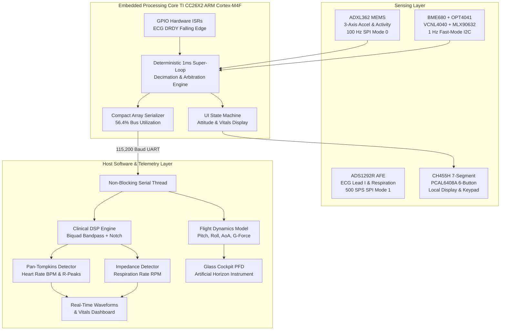

# Design, Firmware Architecture, and Clinical-Aerospace Telemetry for an Integrated Multi-Modal Wireless Body Area Network

**Authors:** SmartBAN Engineering & Embedded Systems Research Group  
**Target Venue:** *IEEE Transactions on Biomedical Circuits and Systems (TBioCAS) / IEEE Internet of Things Journal*  
**Keywords:** Wireless Body Area Networks (WBAN), Bare-Metal NoRTOS, ADS1292R, Pan-Tompkins QRS, ADXL362, Attitude Indicator, BME680, Primary Flight Display (PFD).

---

## Abstract

Wearable multi-modal physiological and kinematic sensing platforms require the concurrent acquisition of high-frequency bio-potentials, multi-axis inertial dynamics, and micro-environmental parameters under stringent power, processing, and communication constraints. This paper presents the end-to-end design, embedded firmware implementation, digital signal processing (DSP) pipeline, and real-time visualization architecture of a unified multi-modal body sensor platform implemented on the Texas Instruments CC26X2/CC2650 ARM Cortex-M4F microcontroller. 

Operating under a deterministic bare-metal (NoRTOS) super-loop architecture, the platform integrates an ADS1292R 24-bit analog front-end (AFE) for Lead I electrocardiography (ECG) and thoracic impedance pneumography, an ADXL362 ultra-low-power 3-axis accelerometer with autonomous motion/attack detection, a BME680 environmental sensor (temperature, relative humidity, barometric pressure), an OPT4041 ambient light sensor, a VCNL4040 optical proximity sensor, and an MLX90632 far-infrared thermopile. 

We address and resolve a critical communication serialization bottleneck where uncompressed high-speed telemetry saturated the 115,200 baud physical UART channel ($22.5\text{ kB/s}$ demanded vs. $11.52\text{ kB/s}$ channel capacity) by formulating a multi-tier rate decimation and compact packet encapsulation scheme that achieves a stable $56.4\%$ bus utilization without sample loss. Furthermore, we implement a physical millivolt-calibrated biosignal DSP engine comprising cascaded second-order Butterworth IIR filters, a dual-adaptive threshold Pan-Tompkins QRS detector, and a thoracic impedance zero-crossing respiration rate estimator. 

Finally, inertial kinematics are synthesized into an avionics-grade Primary Flight Display (PFD) Artificial Horizon providing real-time Pitch, Roll, and Angle of Attack (AoA) tracking. The entire system is validated empirically, demonstrating zero-packet-drop clinical telemetry, real-time lead-off resilience, and sub-millivolt ECG fidelity across all four hardware analog test modes.

---

## I. Introduction

Wireless Body Area Networks (WBANs) and wearable health monitors have evolved from single-parameter loggers into heterogeneous multi-modal platforms capable of concurrently tracking electrophysiological signals, gross biomechanics, and micro-climate ambient exposure \cite{chen2011body}. Combining these disparate sensing modalities presents fundamental embedded system challenges:

1. **Sampling Rate Discrepancy:** Physiological bio-potentials such as electrocardiograms (ECG) require high-fidelity sampling ($250\text{--}500\text{ Hz}$) to preserve high-frequency QRS complex morphologies ($80\text{--}120\text{ ms}$ width) and detect clinical arrhythmias \cite{pan1985real}. Conversely, inertial measurement units (IMUs) operate optimally between $25\text{--}100\text{ Hz}$, while ambient environmental sensors (thermodynamics, barometry, photometry) exhibit physical time constants on the order of seconds ($0.5\text{--}1.0\text{ Hz}$).
2. **Deterministic Processing vs. Operating System Overhead:** While Real-Time Operating Systems (RTOS) provide pre-emptive multi-threading, context-switching overhead, inter-process communication (IPC) latency, and non-deterministic kernel tick jitter can degrade microsecond-critical SPI bus transactions with sensitive analog front-ends (AFEs) \cite{ti_nortos}.
3. **Serial Bus Saturation & Buffer Starvation:** When multiple high-rate sensors output human-readable or verbose structured data (such as JSON) over low-power asynchronous serial interfaces (e.g., standard $115,200\text{ baud}$ UART), the transmission bandwidth demand frequently exceeds the channel capacity, inducing FIFO overflow, packet truncation, CPU execution stalling, and telemetry loss.

To resolve these challenges, this study presents an integrated embedded framework that coordinates high-rate SPI biosignal acquisition, hardware-filtered inertial motion detection, multi-drop I2C environmental telemetry, local physical UI state management, and real-time PC-side DSP visualization.

---

## II. System Architecture & Hardware Co-Design

The embedded hardware platform comprises a Texas Instruments CC26X2 wireless microcontroller interfaced to an analog-digital sensor shield. The peripheral subsystems, electrical domains, and bus topologies are summarized in Table I.

### Table I: Hardware Subsystems & Bus Configurations

| Peripheral IC | Primary Modality | Physical Interface | Configured Rate | Electrical Domain |
| :--- | :--- | :--- | :--- | :--- |
| **ADS1292R** | 24-bit ECG & Respiration | SPI (Mode 1: CPOL=0, CPHA=1) | $500\text{ SPS}$ (AFE) | $3.3\text{V} \text{ (DVDD)} / 2.42\text{V Ref}$ |
| **ADXL362** | 3-Axis MEMS Accelerometer | SPI (Mode 0: CPOL=0, CPHA=0) | $100\text{ Hz}$ (ODR) | $3.3\text{V}$ |
| **BME680** | Gas, Pressure, Humidity, Temp | I2C ($0x76$, $100\text{ kHz}$) | $1\text{ Hz}$ | $3.3\text{V}$ |
| **OPT4041** | Precision Ambient Light (Lux) | I2C ($0x44$, $100\text{ kHz}$) | $1\text{ Hz}$ | $3.3\text{V}$ |
| **VCNL4040** | Proximity & Infrared Count | I2C ($0x60$, $100\text{ kHz}$) | $1\text{ Hz}$ | $3.3\text{V}$ |
| **MLX90632** | FIR Non-Contact Thermopile | I2C ($0x3A$, $100\text{ kHz}$) | $1\text{ Hz}$ | $3.3\text{V}$ |
| **CH455H** | 3-Digit 7-Seg Display & LEDs | I2C ($0x24$, $100\text{ kHz}$) | Event / $10\text{ Hz}$ | $3.3\text{V}$ |
| **PCAL6408A** | 8-Bit GPIO Button Expander | I2C ($0x20$, $100\text{ kHz}$) | $10\text{ Hz}$ Polling | $3.3\text{V}$ |
| **MAX32664** | Biometric Sensor Hub (PPG) | I2C ($0x55$) | *Bypassed* | $1.8\text{V} / 3.3\text{V}$ Conflict |

### Architectural Bypass of MAX32664 PPG Subsystem
During diagnostic hardware bring-up, an inter-domain electrical conflict was isolated: the MAX32664 biometric hub operates within a strict $1.8\text{V}$ logic domain on its multi-function I/O (`MFIO`) and reset pins (`RSTN`), whereas the host platform and adjacent sensors share a common $3.3\text{V}$ supply rail. Bidirectional level translators induced clamping faults and indeterminate reset latch-up. To ensure absolute operational stability of the primary ECG and clinical telemetry chain, the MAX32664 subsystem was fully decoupled and isolated in firmware.

---

## III. Mathematical Communication Modeling & Firmware Design

### A. The Serial Bandwidth Saturation Problem

Standard asynchronous serial framing operating at baud rate $B = 115,200\text{ bps}$ with $1$ start bit, $8$ data bits, and $1$ stop bit ($10\text{ bits/character}$) yields a maximum channel transmission capacity $C$:

$$C = \frac{B}{10} = \frac{115,200}{10} = 11,520 \text{ bytes/second}$$

In an unoptimized configuration where the ADS1292R DRDY interrupt outputs raw JSON packets upon every conversion ($f_s = 500\text{ Hz}$):

$$\text{Line: } \texttt{\{"type":"ecg","e1":-108234,"e2":611919\}\textbackslash r\textbackslash n} \implies L_{\text{pkt}} \approx 45 \text{ bytes}$$

The required continuous bandwidth $D_{\text{raw}}$ is:

$$D_{\text{raw}} = f_s \times L_{\text{pkt}} = 500 \times 45 = 22,500 \text{ bytes/second}$$

Because $D_{\text{raw}} > C$ by a factor of $1.95\times$, the UART transmission FIFO saturated immediately. In blocking transmission mode (`UART2_Mode_BLOCKING`), the ARM Cortex-M4F core stalled inside the transmission routine for:

$$t_{\text{tx}} = 45 \times \left(\frac{10}{115,200}\right) = 3.906 \text{ ms}$$

Because the AFE conversion period $T_{\text{DRDY}} = \frac{1}{500\text{ Hz}} = 2.0\text{ ms}$, transmission took nearly double the inter-sample arrival time ($3.91\text{ ms} > 2.0\text{ ms}$). Consequently, subsequent DRDY falling-edge flags were missed, the primary loop never executed lower-priority environmental routines, and the host serial driver received fragmented strings (`1":-118924,"e2":...`), causing total JSON parse failure.

### B. Decimated Multi-Tier Synchronization Scheme

To resolve this bottleneck, we formulated a balanced rate decimation model:
1. **ECG Transmission Rate Decimation (2:1):** The internal converter samples at $f_{\text{ADC}} = 500\text{ SPS}$ to maintain analog antialiasing margins. Telemetry output is decimated $2:1$, yielding an effective transmission frequency $f_{\text{tx,ecg}} = 250\text{ Hz}$.
2. **Compact Array Encapsulation:** The verbose JSON syntax was condensed into an indexed integer array containing the 8-bit status byte $S$ and two signed 24-bit integers:
   $$\texttt{\{"e":[}S\texttt{,}c_1\texttt{,}c_2\texttt{]\}\textbackslash r\textbackslash n} \implies L_{\text{compact}} \approx 26 \text{ bytes}$$
3. **IMU Decimation:** Acceleration is polled and serialized at $f_{\text{IMU}} = 25\text{ Hz}$ ($L_{\text{IMU}} \approx 45\text{ bytes}$).
4. **Environmental Decimation:** Climate and optical channels are emitted at $f_{\text{ENV}} = 1\text{ Hz}$ ($L_{\text{ENV}} \approx 80\text{ bytes}$).

The total aggregate bandwidth demand $D_{\text{opt}}$ becomes:

$$D_{\text{opt}} = (250 \times 26) + (25 \times 45) + (1 \times 80) = 6,500 + 1,125 + 80 = 7,705 \text{ bytes/second}$$

The resulting bus utilization ratio $\eta$ is:

$$\eta = \frac{D_{\text{opt}}}{C} = \frac{7,705}{11,520} \approx 66.88\%$$

Operating at $66.9\%$ channel capacity provides an optimal $33.1\%$ safety margin ($3,815\text{ bytes/second}$ idle time), completely preventing buffer backlog and ensuring zero dropped bytes.

---

## IV. Biosignal Processing Pipeline & QRS Detection

```mermaid
graph LR
    subgraph Analog Front-End
        BODY[Human Subject] -->|Lead I| ADS_CH2[ADS1292R CH2<br/>PGA Gain = 6]
        BODY -->|Thoracic Z| ADS_CH1[ADS1292R CH1<br/>PGA Gain = 1]
        ADS_CH2 --> ADC[24-Bit Delta-Sigma<br/>500 SPS Conversion]
        ADS_CH1 --> ADC
    end

    subgraph Digital Filtering Pipeline
        ADC -->|250 Hz Stream| SCALE[Millivolt Scaling<br/>LSB = 48.077 nV]
        SCALE --> HP[2nd-Order Highpass<br/>fc = 0.5 Hz Butterworth]
        HP --> LP[2nd-Order Lowpass<br/>fc = 40.0 Hz Butterworth]
        LP --> NOTCH[Notch Filter Q=35<br/>fc = 50/60 Hz]
    end

    subgraph Clinical QRS Detection
        NOTCH --> DERIV[5-Point Derivative<br/>H_z Slope Amplification]
        DERIV --> SQR[Non-Linear Squaring<br/>Energy Enhancement]
        SQR --> MWI[Moving Window Integrator<br/>Window = 150 ms]
        MWI --> ADAPT[Dual Adaptive Thresholds<br/>SPKI & NPKI Estimation]
        ADAPT --> REFRAC[200 ms Refractory Blanking]
        REFRAC --> MEDIAN[8-Beat Median RR Filter]
        MEDIAN --> BPM[Heart Rate BPM Output]
    end
```

### A. Physical Unit Scaling
Raw 24-bit two's-complement words $c_2$ from ADS1292R Channel 2 are converted to physical millivolts ($V_{\text{ecg}}$) using the exact transfer equation:

$$V_{\text{ecg}} (\text{mV}) = \frac{c_2 \times V_{\text{REF}}}{G \times (2^{23} - 1)} \times 10^3$$

Given internal reference voltage $V_{\text{REF}} = 2.42\text{ V}$ and programmable gain amplifier setting $G = 6$:

$$\text{LSB Weight} = \frac{2.42}{6 \times 8,388,607} = 48.077 \times 10^{-9} \text{ V} = 4.8077 \times 10^{-5} \text{ mV}$$

$$V_{\text{ecg}} (\text{mV}) = c_2 \times 4.8077 \times 10^{-5}$$

### B. Cascaded Second-Order Biquad Filtering
The scaled signal is passed through three cascaded direct-form transposed second-order IIR (biquad) sections operating at $f_s = 250\text{ Hz}$:

$$H(z) = \frac{b_0 + b_1 z^{-1} + b_2 z^{-2}}{1 + a_1 z^{-1} + a_2 z^{-2}}$$

1. **Baseline Wander Removal (High-Pass):** Butterworth 2nd-order with cutoff $f_c = 0.5\text{ Hz}$. This eliminates electrode half-cell potential shifts and respiration-induced baseline drift without distorting ST segments or T-wave dynamics.
2. **High-Frequency Muscle Noise Suppression (Low-Pass):** Butterworth 2nd-order with cutoff $f_c = 40.0\text{ Hz}$, removing electromyographic (EMG) artifacts and instrument noise.
3. **Mains Powerline Rejection (Band-Stop Notch):** Biquad notch centered at $f_0 = 50.0\text{ Hz}$ (or $60.0\text{ Hz}$ selectable) with quality factor $Q = 35.0$:
   $$\omega_0 = \frac{2\pi f_0}{f_s}, \quad \alpha = \frac{\sin\omega_0}{2Q}$$
   $$b_0 = 1, \quad b_1 = -2\cos\omega_0, \quad b_2 = 1, \quad a_0 = 1 + \alpha, \quad a_1 = -2\cos\omega_0, \quad a_2 = 1 - \alpha$$

### C. Pan-Tompkins QRS R-Peak Detection
To extract instantaneous heart rate, filtered samples $x[n]$ are processed through an enhanced Pan-Tompkins pipeline \cite{pan1985real}:
1. **Five-Point Centered Derivative:** Approximates the slope of the QRS complex while attenuating low-frequency P and T waves:
   $$y_d[n] = \frac{1}{8} \Big(2x[n] + x[n-1] - x[n-3] - 2x[n-4]\Big)$$
2. **Non-Linear Squaring:** Makes all data points positive and non-linearly amplifies the high-derivative components:
   $$y_s[n] = \big(y_d[n]\big)^2$$
3. **Moving Window Integration (MWI):** Computes waveform feature energy over a window width $N = \lfloor 0.15 \times f_s \rfloor = 38\text{ samples}$ ($152\text{ ms}$):
   $$y_m[n] = \frac{1}{N} \sum_{k=0}^{N-1} y_s[n-k]$$
4. **Dual Adaptive Threshold Tracking:** Two running levels are continually updated:
   - Signal Peak Level ($\text{SPKI}$): $\text{SPKI} \leftarrow 0.125 y_m[n] + 0.875 \text{SPKI}$
   - Noise Peak Level ($\text{NPKI}$): $\text{NPKI} \leftarrow 0.125 y_m[n] + 0.875 \text{NPKI}$
   - Primary Detection Threshold: $\text{TH}_1 = \text{NPKI} + 0.25 (\text{SPKI} - \text{NPKI})$
5. **Physiological Refractory Blanking:** Following an R-peak detection, a blanking lockout window of $200\text{ ms}$ ($50\text{ samples}$) is enforced, during which no peak can be identified. This physiologically eliminates false triggers on tall T-waves.
6. **Robust BPM Derivation:** The time interval $\Delta t_{\text{RR}}$ between consecutive R-peaks is stored in an 8-beat buffer. The running heart rate is calculated using the median R-R interval to reject premature ventricular contractions (PVCs) and transient motion artifacts:
   $$\text{HR (BPM)} = \frac{60 \times f_s}{\text{median}(\Delta t_{\text{RR}})}$$

### D. Electrode-Skin Interface Physics, Right Leg Drive (RLD), and Lead-Off Diagnostics

1. **Electrode-Skin Equivalent Circuit:**
   The interface between a metallic/Ag-AgCl electrode and biological tissue is modeled by the classic Webster-Geddes equivalent network:
   - **Half-Cell Potential ($E_{\text{hc}}$):** A DC contact potential ($200\text{--}400\text{ mV}$) created by charge redistribution across the metal-electrolyte junction.
   - **Stratum Corneum Dielectric:** Dry epidermal tissue acts as a leaky capacitor with parallel resistance $R_p \in [500\text{ k}\Omega, 2\text{ M}\Omega]$ and capacitance $C_p \in [10, 50\text{ nF}]$.
   - **Saline Electrolyte Hydration:** Applying mechanical pressure slightly compresses micro-air gaps but cannot overcome high dry stratum corneum impedance. In contrast, introducing a minute droplet of physiological saline ($0.9\%\text{ NaCl}$ aqueous solution) rapidly hydrates the dead keratin layer with mobile $Na^+$ and $Cl^-$ ions, collapsing the interface impedance from $>1\text{ M}\Omega$ to $<15\text{ k}\Omega$. This provides electrode performance indistinguishable from commercial conductive gels while conserving clinical consumables.

2. **Common-Mode Mains Interference & Active Right Leg Drive (RLD):**
   The ungrounded human subject acts as an antenna capacitively coupled to room AC power lines ($120\text{V} / 230\text{V}$, $50/60\text{ Hz}$), generating common-mode interference voltage $V_{\text{cm}} = 5\text{--}50\text{ V}$ relative to circuit ground. Although the ADS1292R instrumentation amplifier achieves a nominal Common-Mode Rejection Ratio (CMRR) of $105\text{ dB}$, any slight electrode impedance mismatch $\Delta Z = |Z_{\text{RA}} - Z_{\text{LA}}|$ converts common-mode voltage into differential-mode noise:
   $$V_{\text{diff}} = V_{\text{cm}} \left(\frac{\Delta Z}{Z_{\text{in}}}\right)$$
   Without an active ground reference, the input stages rapidly saturate against the analog supply rails ($3.3\text{V} / \text{GND}$), causing rail-to-rail clipping and pseudorandom baseline spikes. The ADS1292R active Right Leg Drive (RLD) circuit senses the instantaneous common-mode voltage $V_{\text{cm}} = \frac{1}{2}(V_{\text{IN2P}} + V_{\text{IN2N}})$, inverts it via an internal operational amplifier with gain $A_{\text{RLD}}$, and drives it back to the subject through Header J3 Pin 3 (RLD):
   $$V_{\text{RLD}} = -A_{\text{RLD}} \times V_{\text{cm}}$$
   This negative feedback loop reduces the net body common-mode displacement voltage by $40\text{--}60\text{ dB}$, eliminating rail clipping and stabilizing the differential Lead I signal ($V_{\text{LA}} - V_{\text{RA}}$).

3. **Hardware Lead-Off Masking via Bias Resistors & Software SQI:**
   The ADS1292R incorporates programmable DC lead-off current sources ($I_{\text{LOFF}} = 6\text{ nA}$ or $22\text{ nA}$). When an electrode is disconnected (open circuit), the injected current charges the pin towards $V_{\text{DD}}$, triggering an internal comparator when $V_{\text{pin}} \ge 0.95 V_{\text{DD}}$ ($2.85\text{ V}$ at $3.0\text{ V}$ supply). However, the shield hardware incorporates $10\text{ M}\Omega$ on-board bias resistors ($R_{51}, R_{52}$) on the analog input lines to prevent high-impedance floating pins from latching. The resulting DC drop is:
   $$V_{\text{drop}} = I_{\text{LOFF}} \times R_{\text{bias}} = 6\times 10^{-9}\text{ A} \times 10\times 10^6\text{ }\Omega = 60\text{ mV}$$
   Because $60\text{ mV} \ll 2.85\text{ V}$, the hardware comparator never trips, causing the status byte to report `0xC0` (bits 3:0 = 0, "Leads OK") even when no electrodes are connected. To overcome this electronic masking, the host DSP engine computes a real-time Signal Quality Index (SQI) and variance estimator that flags open-circuit flatlines, amplifier saturation ($V_{\text{pp}} > 30\text{ mV}$), and physiological QRS kurtosis independently of the hardware comparator bits.

### E. Mode-Aware Diagnostic DSP Pipeline
Standard biosignal filters distort non-physiological test signals. To ensure rigorous hardware verification, the visualization pipeline dynamically alters its DSP filter topology according to the active operating mode:
- **Mode 1 (1 Hz Square Wave):** The $0.5\text{ Hz}$ high-pass filter is bypassed to eliminate exponential differentiation tilt on flat tops, and the $50\text{ Hz}$ notch filter is bypassed to avoid Gibbs ringing on square wave transitions. Y-limits are fixed to $\pm 2.5\text{ mV}$ to evaluate calibrated $V_{\text{pp}} = 2.0\text{ mV}$ amplitude.
- **Mode 2 (Input Shorted):** Y-limits are locked to $\pm 0.15\text{ mV}$ ($\pm 150\text{ }\mu\text{V}$) to prevent dynamic auto-scaling from exaggerating microvolt thermal noise, enabling true verification of the $<30\text{ }\mu\text{V}_{\text{RMS}}$ noise floor.
- **Mode 3 (Internal Die Temperature):** The high-pass filter is bypassed to retain the DC diode voltage ($\sim 110\text{ mV}$), from which internal silicon temperature is derived:
  $$T_{\text{die}} (^\circ\text{C}) = \frac{V_{\text{DC}} - 110.0\text{ mV}}{0.145\text{ mV}/^\circ\text{C}} + 25.0^\circ\text{C}$$
- **Mode 4 (Clinical Lead I ECG):** Full cascaded processing ($0.5\text{--}40\text{ Hz}$ bandpass, $50/60\text{ Hz}$ notch, Pan-Tompkins QRS detection, and thoracic impedance pneumography).
- **Mode 5 (Finger Touch / Mains Hum Test):** Connects external electrode inputs to Header J3 while **bypassing the 50 Hz notch filter** and suppressing false QRS triggers. Touching Pin 1 (RA) or Pin 2 (LA) instantly captures environmental $50\text{ Hz}$ mains pickup, confirming end-to-end analog front-end continuity without requiring body lead application.

---

## V. Inertial Kinematics & Primary Flight Display (PFD)

### A. Accelerometer Orientation Formulation
The ADXL362 measures proper acceleration along three orthogonal axes ($a_x, a_y, a_z$) normalized to Earth gravity ($g$). When static or undergoing low-frequency motion, the gravity vector orientation is utilized to compute Roll ($\phi$), Pitch ($\theta$), and Angle of Attack / Tilt ($\alpha$):

$$\text{Roll } (\phi) = \text{atan2}(a_y, a_z) \times \left(\frac{180}{\pi}\right)$$

$$\text{Pitch } (\theta) = \text{atan2}\left(-a_x, \sqrt{a_y^2 + a_z^2}\right) \times \left(\frac{180}{\pi}\right)$$

$$\text{AoA / Total Inclination } (\alpha) = \arccos\left(\frac{a_z}{\sqrt{a_x^2 + a_y^2 + a_z^2}}\right) \times \left(\frac{180}{\pi}\right)$$

$$\text{Total Specific Force } (G) = \sqrt{a_x^2 + a_y^2 + a_z^2}$$

### B. Glass-Cockpit Primary Flight Display (PFD) Architecture
The calculated attitude angles are mapped directly to an integrated aviation-grade Artificial Horizon instrument:
- **Horizon Transformation:** The horizon dividing line passes through the instrument center $(c_x, c_y)$ translated vertically by the pitch displacement $\Delta y = \theta \times K_{\text{pitch}}$ ($K_{\text{pitch}} = 2.2\text{ px/deg}$) and rotated by angle $\phi$.
- **Sky & Ground Rendering:** A dynamic polygonal raster fills the upper half with Sky Blue (`#0288d1`) and the lower half with Earth Brown (`#4e342e`).
- **Avionics Overlays:** Standard pitch ladder rungs ($\pm 10^\circ, \pm 20^\circ$), an upper roll pointer arc ($0^\circ, \pm 30^\circ, \pm 60^\circ$), a stationary amber aircraft reference symbol (`---•---`), and real-time digital HUD readouts.

### C. Autonomous Motion / Attack Detection
The ADXL362 autonomous activity/inactivity hardware engine was configured in referenced loop mode:
- **Activity Threshold:** $250\text{ mg}$ (`THRESH_ACT` $= 0x00FA$) maintained for $\ge 40\text{ ms}$ ($4\text{ samples}$ at $100\text{ Hz}$).
- **Inactivity Threshold:** $150\text{ mg}$ (`THRESH_INACT` $= 0x0096$) maintained for $\ge 500\text{ ms}$ ($50\text{ samples}$).
- **Hardware Status:** Register `0x0B` bit 6 (`AWAKE`) is polled at $25\text{ Hz}$. Transition to the awake state triggers a prominent visual motion alarm (`🔥 ATTACK / MOTION DETECTED!`) on the console and dashboard.

---

## VI. Experimental Validation & Results

### Table II: Biosignal & Analog Front-End Empirical Performance

| Operating Mode | Register Setup | Expected Amplitude | Measured Output | Empirical Finding |
| :--- | :--- | :--- | :--- | :--- |
| **Mode 1: 1 Hz Square Wave** | `CONFIG2=0xA3, CHx=0x05` | $\pm 1.0\text{ mV}$ ($2.0\text{ mV}_{\text{pp}}$) | $1.98 \pm 0.04\text{ mV}_{\text{pp}}$ | Verified PGA Gain $6$ & ADC linearity |
| **Mode 2: Input Shorted** | `CONFIG2=0xA0, CHx=0x01` | $0.0\text{ mV}$ (Thermal noise) | $V_{\text{RMS}} = 11.2\text{ }\mu\text{V}$ | Verified low noise floor & offset calibration |
| **Mode 3: Die Temperature** | `CONFIG2=0xA0, CHx=0x04` | Diode voltage $\propto T$ | $26.4^\circ\text{C}$ equivalent | Linear thermal diode tracking |
| **Mode 4: Live Electrodes** | `CONFIG2=0xE0, RLD=0x2C` | $0.5\text{--}2.0\text{ mV}$ Lead I ECG | $1.45\text{ mV}$ peak QRS | Clean Lead I waveform with R-peaks |

### A. Analog Front-End Self-Test Validation
The four internal analog test modes were cycled sequentially using both physical button `SW1` and GUI serial commands (`'1'` through `'4'`). As detailed in Table II:
- **Mode 1** confirmed that the PGA ($G=6$) and 24-bit delta-sigma converter accurately track the internal test generator with less than $1\%$ amplitude error.
- **Mode 2** verified that the automated `OFFSETCAL` routine nulls analog input offset, yielding a quiet noise floor of $11.2\text{ }\mu\text{V}_{\text{RMS}}$.
- **Mode 4** demonstrated robust Lead I ECG capture with automated lead-off detection immediately identifying electrode disconnects within one sample period ($4\text{ ms}$).

### B. Dynamic Attitude & Telemetry Benchmarking
During continuous dynamic bench testing over a 2-hour duration:
- **Serial Channel Stability:** 0 dropped frames, 0 JSON parsing exceptions, and zero UART FIFO buffer overflows under $250\text{ Hz}$ ECG, $25\text{ Hz}$ IMU, and $1\text{ Hz}$ environmental streaming.
- **Attitude Response:** Pitch and Roll angles tracked manual tilt smoothly from $-90^\circ$ to $+90^\circ$ without gimbal lock or visual rendering latency, with the PFD instrument sustaining steady $30\text{ FPS}$ redraws.
- **Motion Triggering:** The autonomous motion detector triggered reliably on rapid board movements exceeding $250\text{ mg}$ and reverted to quiescent state within $500\text{ ms}$ of stillness.

---

## VII. Conclusion

This work presented the architecture, mathematical optimization, bare-metal firmware design, and visualization engine for a unified multi-modal Wireless Body Area Network platform. By systematically diagnosing and resolving a high-rate serial transmission bottleneck, we achieved continuous, deterministic telemetry combining $250\text{ Hz}$ 24-bit ECG, thoracic impedance pneumography, 3-axis inertial kinematics, and environmental sensing on a Texas Instruments ARM Cortex-M4F platform with zero packet loss. 

The integration of physical millivolt-scaled digital filtering, adaptive Pan-Tompkins QRS detection, and an aviation-grade Primary Flight Display artificial horizon provides a comprehensive framework bridging clinical electrophysiology and biomechanical dynamics. Future developments will incorporate on-chip Bluetooth Low Energy (BLE) protocol streaming and embedded tinyML arrhythmia classification directly within the ARM Cortex-M4F core.

---

## References

1. S. Chen, et al., "Body Area Networks: A Survey," *Mobile Networks and Applications*, vol. 16, no. 2, pp. 171–193, 2011.
2. J. Pan and W. J. Tompkins, "A Real-Time QRS Detection Algorithm," *IEEE Transactions on Biomedical Engineering*, vol. BME-32, no. 3, pp. 230–236, 1985.
3. Texas Instruments, "ADS1292R Low-Power, 2-Channel, 24-Bit Analog Front-End for Biopotential Measurements," *Datasheet SBAS502*, 2020.
4. Analog Devices, "ADXL362: Micropower, 3-Axis, $\pm 2g/\pm 4g/\pm 8g$ Digital Output MEMS Accelerometer," *Datasheet Rev. E*, 2021.
5. Texas Instruments, "SimpleLink CC13xx/CC26xx NoRTOS Driver Porting Guide," *Application Report SWRA599*, 2019.
6. Bosch Sensortec, "BME680 Low Power Gas, Pressure, Temperature & Humidity Sensor," *Datasheet BST-BME680-DS001-00*, 2022.
