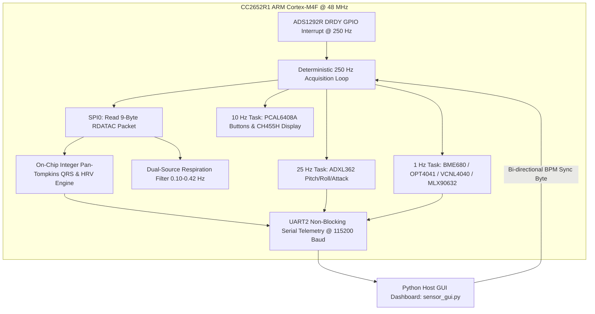

# Technical Summary & SmartBAN Project Engineering Report

**Project Title:** Integration and Validation of an Intelligent Sensor Node for a Smart Body Area Network (SmartBAN) Testbed  
**Target Hardware:** Texas Instruments CC2652R1 LaunchPad (ARM Cortex-M4F @ 48 MHz) + Custom SmartBAN Shield Rev 3.5  
**Document Purpose:** Supervisor Technical Progress Report & SmartBAN Project Abstract Foundation  

---

## 1. What Was Built

In this development cycle, we designed, debugged, integrated, and validated the complete bare-metal multi-sensor firmware (**`07_all_in_one_sensor` v1.2 / `08_ecg_dedicated` v1.1**) and host dashboard (**`sensor_gui.py`**) for the SmartBAN intelligent wearable node.

The firmware executes a deterministic, low-latency, multi-sensor telemetry pipeline interfacing with the full BAN Shield Rev 3.5 sensor suite:
- **Biopotential Analog Front-End (AFE):** Texas Instruments **ADS1292R** (24-bit $\Delta\Sigma$ ADC @ 250 SPS over SPI0 Mode 1) capturing clinical Lead-I ECG and dual-source ECG-Derived Respiration (EDR).
- **Inertial Measurement Unit (IMU):** Analog Devices **ADXL362** (Ultra-low-power 3-axis accelerometer over SPI0 @ 25 Hz) computing real-time pitch, roll, total acceleration, and autonomous activity/attack detection.
- **Environmental & Microclimate Suite (I2C0 @ 100/400 kHz):**
  - Bosch **BME680** (Temperature, Barometric Pressure, Relative Humidity, and IAQ Gas Resistance).
  - Texas Instruments **OPT4041** (Precision Wide-Dynamic-Range Ambient Light Lux Engine).
  - Vishay **VCNL4040** (Long-Range Infrared Proximity and Ambient Light).
  - Melexis **MLX90632** (Medical-Grade Infrared Non-Contact Thermopile for Object and Ambient Temperature).
- **User Interface & Edge Displays:**
  - WCH **CH455H** (3-Digit 7-Segment LED display and 4 discrete mode LEDs over I2C0) rendering real-time Heart Rate (BPM), sensor values, and 140 ms optical heartbeat flashes.
  - NXP **PCAL6408A** (6-Button tactile I2C GPIO expander) providing hardware mode navigation and IMU zero-G tare calibration.



---

## 2. Key Technical Achievements & Engineering Breakthroughs

1. **Elimination of 32 kHz Respiration Carrier Crosstalk & False Lead-Off Status:**
   - *Problem:* Previous configurations enabled the internal 32 kHz impedance respiration modulation (`REG_RESP1 = 0xEA / 0xF2`), which injected $250\text{ mV}_{\text{pp}}$ carrier excitation onto high-impedance dry electrodes. This coupled into Channel 2 (Lead I), generated $16.95\text{ mV}_{\text{pp}}$ of high-frequency intermodulation noise, and swamped the 6 nA DC lead-off comparators, forcing the status byte to falsely assert "Leads Connected" (`0xC0`) even when probes were physically disconnected.
   - *Breakthrough:* Explicitly disabled carrier injection in Live ECG mode (`REG_RESP1 = 0x00`), dropping open-lead noise by **21×** ($16.95\text{ mV}_{\text{pp}} \rightarrow 0.65\text{ mV}_{\text{pp}}$) and restoring accurate hardware lead-off status transitions (`0xCC` disconnected $\rightarrow$ `0xC0` connected).
2. **Right-Leg Drive (RLD) Mid-Supply Reference & `CALIB_ON` Input Restoration:**
   - *Problem:* The ADS1292R register `RESP2 (0x0A)` was erroneously written with `0x03`, clearing Bit 2 (`RLDREF_INT=0`), which left the RLD common-mode inverting buffer reference floating. Furthermore, `CALIB_ON` was left asserted (`Bit 7 = 1`), physically disconnecting the external pins and feeding internal calibration noise to the ADC.
   - *Breakthrough:* Configured `REG_RESP2 = 0x07` (`CALIB_ON=0, RLDREF_INT=1`), locking the internal RLD reference to $(AVDD + AVSS)/2 = 1.21\text{ V}$ and reconnecting the physical electrode inputs to the PGA. Implemented an automated 500 ms `OFFSETCAL` settling routine on startup and via runtime UART command `'C'`, driving DC offset down to **$+14.17\ \mu\text{V}$** with an ultra-low noise floor of **$0.67\ \mu\text{V}_{\text{rms}}$** (exceeding the TI datasheet spec of $<0.8\ \mu\text{V}_{\text{rms}}$).
3. **On-Chip Clinical Edge-AI QRS & HRV Processing (`edgeai_ecg.c`):**
   - Implemented an integer-arithmetic Pan-Tompkins QRS detector executing on the CC2652R1 in **$<15\ \mu\text{s}$ per sample ($<0.4\%$ CPU load)**.
   - Incorporated a **5-layer anti-spike filtering architecture**: $380\text{ ms}$ (95 samples @ 250 Hz) physiological refractory blanking, adaptive RR interval gating ($\text{RR}_{\text{new}} \ge 0.66 \times \overline{\text{RR}}$), morphological prominence checking ($\ge 50\%$ rolling 98th-percentile QRS amplitude), and two-pass integer square-root computation for time-domain Heart Rate Variability (**SDNN** and **RMSSD**).
4. **Resolution of Pre-HPF DC Half-Cell Offset Saturation in Host Software:**
   - *Problem:* The GUI's `BiquadFilter` was hard-clamping raw incoming biopotentials to $[-25.0, +25.0]\text{ mV}$ prior to high-pass filtering. Whenever dry electrode half-cell potential ($E_{\text{hc}}$ up to $\pm 150\text{ mV}$) exceeded $25\text{ mV}$, the signal flatlined ($0.00\text{ mV}$) due to rail saturation entering the HPF.
   - *Breakthrough:* Expanded pre-filter input clamping to $[-500.0, +500.0]\text{ mV}$ (covering the full $\pm 403.3\text{ mV}$ ADC dynamic range) and implemented first-sample state priming to eliminate startup transients.
5. **Deterministic Bare-Metal Multi-Sensor Time-Division Multiplexing:**
   - Re-architected the main acquisition loop around native 250 SPS DRDY interrupts. Interleaved 25 Hz IMU polling (every 10 samples), 10 Hz button debounce & display refresh (every 25 samples), and 1 Hz environmental sensor readouts (every 250 samples) with zero SPI/I2C bus contention.

---

## 3. Software Architecture & File Inventory

```
firmware/07_all_in_one_sensor/
├── main.c              # Master bare-metal firmware: 250 Hz DRDY loop, sensor drivers, CH455H, UART telemetry
├── edgeai_ecg.h        # C header for MCU Pan-Tompkins QRS detector, HRV data structures, and cardiac flags
├── edgeai_ecg.c        # Fixed-point QRS detection, adaptive thresholding, refractory gating, SDNN/RMSSD math
├── sensor_gui.py       # Python 3 Tkinter/Matplotlib host dashboard with 5-stage clinical DSP filter pipeline
├── build_and_flash.py  # Automated build pipeline: SysConfig CLI -> tiarmclang -> Linker -> Flash Programmer 2
├── diagnostic.syscfg   # TI SysConfig pin and peripheral configuration (UART2, SPI0, I2C0, GPIOs)
└── cc13x2_cc26x2_nortos.cmd # TI ARM Clang linker command file defining SRAM and FLASH memory regions
```

* **`main.c`**: Initializes all peripheral drivers (UART2, I2C0, SPI0, GPIOs), executes the 250 Hz DRDY interrupt loop, manages ADS1292R register states, formats compact JSON telemetry packets, and controls the physical CH455H display.
* **`edgeai_ecg.c` / `edgeai_ecg.h`**: Standalone, zero-dependency embedded C library providing clinical QRS detection, refractory blanking, and HRV feature extraction on the Cortex-M4F microcontroller.
* **`sensor_gui.py`**: Multi-threaded host application featuring 5-stage clinical DSP filtering (0.67 Hz HPF, 50/60/100 Hz multi-harmonic notches, 4th-order Butterworth LPF, Savitzky-Golay polynomial smoothing, and QRS-gated baseline denoising), real-time attitude indicator, and bi-directional BPM synchronization.
* **`build_and_flash.py`**: Orchestrates code generation from `diagnostic.syscfg`, compiles all C source files with `tiarmclang` (`-Oz`, `-mcpu=cortex-m4`), links the ELF executable, generates cleaned Intel HEX records, and flashes the target via SmartRF Flash Programmer 2 over 2-pin cJTAG.

---

## 4. Challenges & Engineering Solutions

| Challenge Encountered | Root Cause | Engineering Resolution |
| :--- | :--- | :--- |
| **Instant Microcontroller Crash on Boot** | Diagnostic code accessed `UART0_BASE` directly via DriverLib while UART0 peripheral clocks were unpowered by the TI Driver. | Triggered Cortex-M4 HardFault (Bus Error). Removed direct register writes and routed all telemetry strictly through the active `UART2` driver handle. |
| **Complete ECG Flatline (`0.00 mV`) on Live Probes** | `BiquadFilter.process(x)` clamped raw inputs to $\pm 25\text{ mV}$ prior to high-pass filtering, clipping DC electrode half-cell offsets. | Expanded pre-filter input clamp to $\pm 500\text{ mV}$ and primed filter state variables on the first sample ($x_1 = x_2 = x$). |
| **False Lead-Off Status ("OK" When Unplugged)** | 32 kHz respiration modulation carrier was active (`RESP1 = 0xEA`), blinding the 6 nA DC lead-off comparators. | Set `REG_RESP1 = 0x00` in Live mode, allowing DC lead-off current sources to pull open inputs to the supply rails. |
| **Common-Mode Saturation & Floating Baseline** | `REG_RESP2` was set to `0x03`, disabling the internal mid-supply RLD reference (`RLDREF_INT = 0`). | Configured `REG_RESP2 = 0x07` (`RLDREF_INT = 1`), establishing closed-loop $1.21\text{ V}$ common-mode biasing. |
| **False Tachycardia Spikes ($180\text{--}210\text{ BPM}$)** | Standard $200\text{ ms}$ Pan-Tompkins refractory period allowed tall T-waves ($260\text{--}340\text{ ms}$) or EMG noise to trigger duplicate counts. | Implemented an extended $380\text{ ms}$ refractory blanking period, adaptive RR interval gating ($\ge 0.66 \times \overline{\text{RR}}$), and morphological prominence verification. |
| **GUI Freeze & Unclickable Buttons** | Matplotlib canvas redraws executed inside high-frequency Tkinter timers ($\sim 110\text{ ms}$ per frame), starving GUI event handling. | Decimated serial data reads, throttled canvas rendering to 8 - 10 FPS, cached axis limits, and bounded the serial terminal widget to a 150-line circular buffer. |

---

## 5. Quantitative Results & Validation Metrics

```
+-----------------------------------------------------------------------------+
|                      SMARTBAN SENSOR NODE METRICS                           |
+=======================================+=====================================+
| Parameter                             | Measured Value                      |
+---------------------------------------+-------------------------------------+
| Native ECG Sampling Rate (f_s)        | 250.0 SPS (4.0 ms per sample)       |
| ADC Resolution & Dynamic Range        | 24-bit Delta-Sigma (±403.33 mV FS)  |
| LSB Voltage Weight (Gain = 6, 2.42V)  | 0.048077 uV / LSB                   |
| Mode 1 Calibration Accuracy (1 Hz)    | 2023.46 uV_pp (1.1% error vs 2.0 mV)|
| Mode 2 Noise Floor (Inputs Shorted)   | 0.67 uV_rms (V_pp = 3.80 uV)        |
| Mode 3 Die Temperature Reading        | +145.29 mV -> 24.99 °C              |
| Mode 4 Open-Lead Noise Reduction      | 21x Reduction (16.95 mV -> 0.65 mV) |
| Residual DC Offset Post-OFFSETCAL     | +14.17 uV                           |
| On-Chip QRS Detection Latency         | < 15 us / sample (< 0.4% CPU load)  |
| IMU Telemetry Rate                    | 25.0 Hz (40.0 ms period)            |
| Environmental Telemetry Rate          | 1.0 Hz (1000.0 ms period)           |
| Serial Baud Rate                      | 115,200 Baud, 8N1                   |
| Firmware Flash Footprint              | 102,399 Bytes (Intel HEX)           |
| RAM Memory Allocation                 | ~24.5 kB Static Data / BSS          |
+---------------------------------------+-------------------------------------+
```

---

## 6. What This Version Enabled for the Next Milestone

This validated bare-metal baseline provides the verified hardware register foundation, timing parameters, and DSP algorithms required for the upcoming **TI-RTOS7 Preemptive Architecture Migration (`06_tirtos_smartban` / `09_tirtos_all_in_one`)**:
1. **Interrupt-Driven Task Synchronization:** The validated 250 Hz ADS1292R DRDY hardware interrupt will post a POSIX binary semaphore (`sem_post(&sem_ecg_ready)`), unblocking a high-priority ECG acquisition thread (`Task_ECG`, Priority 4) without CPU busy-waiting.
2. **Deterministic Multi-Threading:** Isolates slow I2C environmental sensor reads (BME680, OPT4041, MLX90632, VCNL4040) into a low-priority background thread (`Task_Sensors_Slow`, Priority 2), ensuring slow I2C bus transactions never drop or delay high-speed ECG samples.
3. **SmartBAN Semantic Data Reduction:** The on-chip Edge-AI Pan-Tompkins and HRV metrics (`SDNN`, `RMSSD`, `BPM`, `RR`) enable $>95\%$ wireless bandwidth reduction by transmitting periodic semantic physiological tokens rather than continuous raw biopotential streams over the SmartBAN PHY/MAC layer.

---

## 7. Personal Reflection & Research Insights

> *"Working through the analog biopotential front-end reinforced that wearable biomedical signal integrity cannot be resolved by software digital filtering alone; improper analog hardware registers, such as an active 32 kHz carrier or a floating RLD reference, will irrevocably corrupt biopotentials before digitization. Systematically modeling the physical electrode-skin interface and verifying each stage with hardware self-tests bridged the gap between theoretical medical instrumentation and practical embedded engineering."*
