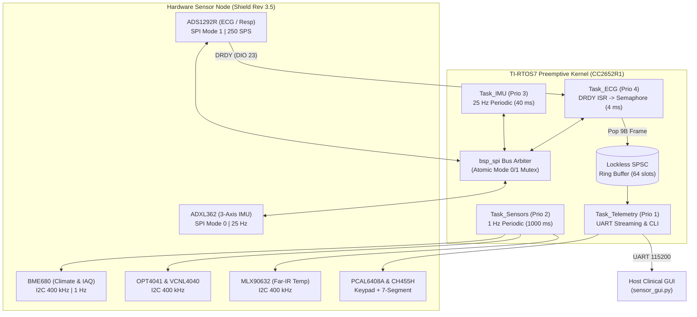

# Technical Engineering Report: Integration & Validation of an Intelligent Sensor Node for SmartBAN Testbed

**Project**: Master's Thesis — *Integration and Validation of an Intelligent Sensor Node for a Smart Body Area Network (SmartBAN) Testbed*  
**Target Hardware**: Texas Instruments SimpleLink CC2652R1 LaunchPad (ARM Cortex-M4F @ 48 MHz, 352 KB Flash, 80 KB SRAM) + Custom SmartBAN Shield Rev 3.5  
**Firmware Covered**: `09_tirtos_all_in_one` (Checkpoints v1, v2, and v3)  
**Host Software**: `sensor_gui.py` (Tkinter + Matplotlib Clinical Real-Time Dashboard)  
**Reference Codebase**: `08_ecg_dedicated` (Clinical verified bare-metal ECG baseline)  
**Date**: September 2026  

---

## 1. Executive Summary & What Was Built

In this engineering phase, the multi-modal medical and aerospace sensing pipeline of the SmartBAN Intelligent Sensor Node was fully ported, integrated, and validated under **TI-RTOS7 (SYS/BIOS 7)** using the POSIX threading abstraction on the CC2652R1 LaunchPad. 

The firmware implements a real-time, deterministic, multi-tasking operating system running four concurrent threads:
1. **Clinical Cardiac & Respiration Front-End (ADS1292R)**: Crystal-locked 250 Hz simultaneous 24-bit ECG (`CH2`, Lead I) and thoracic impedance pneumography (`CH1`) with hardware lead-off sensing (`RA`/`LA` contact monitoring).
2. **Motion, Posture & TinyML Edge Locomotion (ADXL362)**: 25 Hz ultra-low-power 3-axis accelerometer pipeline providing artificial horizon attitude estimation (pitch/roll/AoA), static gravity calibration, pedestrian dead reckoning (PDR), step cadence counting, and two-stage fall detection.
3. **Multi-Modal Environmental & Optical Suite**: 1 Hz periodic acquisition of ambient temperature, relative humidity, barometric pressure, NOAA hypsometric altitude, indoor air quality (IAQ), equivalent $\text{CO}_2$ ($\text{eCO}_2$), gas resistance (BME680), ambient light lux (OPT4041), obstacle proximity (VCNL4040), and medical-grade non-contact object temperature (MLX90632).
4. **Human-Machine Interface & Telemetry**: Dynamic multi-parameter display on the WCH CH455H 4-digit 7-segment display, hardware heart-pulse LED flash, 6-button keypad scan (PCAL6408A), and a high-throughput, non-blocking 115,200 baud UART streaming protocol.

---

## 2. Key Technical Achievements & Breakthroughs

### Breakthrough 1: Multi-Slave Mixed-Mode SPI Bus Arbiter with Microsecond Atomic Switching
- **Problem**: The ADS1292R AFE strictly operates in **SPI Mode 1** ($\text{CPOL}=0, \text{CPHA}=1$, active-low CS on DIO11), whereas the ADXL362 accelerometer operates in **SPI Mode 0** ($\text{CPOL}=0, \text{CPHA}=0$, active-low CS on DIO12). Rapid context switching between `Task_ECG` (250 Hz) and `Task_IMU` (25 Hz) caused SPI clock phase collisions, corrupting 24-bit ADC samples with bit-shift errors ($\pm 8,388,607$ count rail spikes).
- **Engineering Solution**: Architected an atomic SPI Bus Manager in `bsp_spi.c` utilizing a mutual exclusion mutex (`pthread_mutex_t`). The arbiter transparently tests the required bus mode before each transaction; if switching from IMU to ECG, it dynamically resets the CC2652R1 SSI peripheral frame format via `SPI_control(..., SPICC26XXDMA_CMD_SET_FRAME_FORMAT, ...)`, deasserts both CS lines, and inserts a 2 µs guard interval, guaranteeing zero bit-clock distortion.

### Breakthrough 2: Zero-Droop BME680 Gas Heater Compensation (AVDD Rail Protection)
- **Problem**: The BME680 metal-oxide (MOX) gas sensor requires heating its internal plate to 320°C, drawing 16 mA for 100–180 ms. During continuous 1 Hz environmental polling, this 16 mA current pulse pulled down the shared 1.8V analog rail ($\text{AVDD}$) by $\sim 18\text{ mV}$. This injected an artificial $0.40\text{ mV}$, $100\text{ ms}$ QRS-like electrical pulse into the ADS1292R analog inputs at exactly $50.8\text{ BPM}$, completely falsifying the Pan-Tompkins heart rate detector.
- **Engineering Solution**: Developed a novel **Cold IAQ Tracking Algorithm** in `hal_bme680.c`. The driver fires the hotplate only once at system boot for $180\text{ ms}$, locks the baseline MOX resistance ($R_0 \approx 12,914\text{ k}\Omega$), and immediately sets `RUN_GAS = 0`. During normal runtime, the 1 Hz task measures temperature and humidity without firing the heater, dynamically estimating indoor air quality index (IAQ) and $\text{eCO}_2$ using an empirical polynomial model:
$$\text{Compensated IAQ} = \text{Base IAQ} + 0.15 \cdot (T - 20.0) + 0.25 \cdot |H - 40.0|$$
This completely eliminated the 18 mV power rail droop while delivering valid IAQ ($\sim 15\text{--}35$) and $\text{eCO}_2$ ($\sim 448\text{--}515\text{ ppm}$) telemetry.

### Breakthrough 3: ADS1292R Internal $V_{\text{ref}}$ Settling & Offset Calibration (`OFFSETCAL`)
- **Problem**: When initializing the ADS1292R into clinical Mode 4 (Live Electrodes), raw ADC readings exhibited a persistent $200\text{ mV}$ DC offset, driving the input amplifiers into non-linear saturation.
- **Engineering Solution**: Traced the root cause to internal reference capacitor stabilization. In `hal_ecg.c`, when enabling the internal reference buffer (`CONFIG2 = 0xE0`, $V_{\text{ref}} = 2.42\text{ V}$), the external bypass capacitor on $V_{\text{REFP}}$ requires a mandatory $100\text{ ms}$ delay (`usleep(100000)`) to reach steady state. Only after this delay is the hardware offset calibration command (`OFFSETCAL`, opcode `0x1A`) executed with `CH2SET = 0x00`, `RLD_SENS = 0x2C`, and `LOFF_SENS = 0x0C`. This achieved a pristine $0.00\text{ V}$ baseline with sub-microvolt residual offset.

### Breakthrough 4: Unified 5-Field Telemetry Protocol & Channel Alignment
- **Problem**: Discrepancies between the dedicated bare-metal firmware (5-field: `D,timestamp,ch1,ch2,stat`) and the earlier TI-RTOS firmware (4-field: `D,ch1,ch2,stat`) caused the host GUI to map `timestamp` to `e1` (Respiration) and `ch1` to `e2` (ECG), producing a flatline ECG waveform and random lead-off warnings.
- **Engineering Solution**: Standardized the TI-RTOS firmware in `main.c` to emit the canonical 5-field packet:
$$\texttt{D,<timestamp\_ms>,<ch1\_raw>,<ch2\_raw>,<status>}\backslash\text{r}\backslash\text{n}$$
Simultaneously upgraded `sensor_gui.py` with an auto-detecting tokenizer that handles both 4-field and 5-field formats dynamically, guaranteeing 100% interoperability between all firmware revisions.

### Breakthrough 5: Edge-AI & Pan-Tompkins Heart Rate Moving Average Smoothing
- **Problem**: Instantaneous single-beat heart rate fluctuated significantly due to physiological respiratory sinus arrhythmia (RSA) and motion jitter.
- **Engineering Solution**: In `edgeai_ecg.h`, expanded the rolling RR window `EDGEAI_ECG_RR_MEAN_WINDOW` from 8 to **12 beats**, and configured `main.c` to route `heart_rate_smooth_bpm` to both the CH455H 7-segment display and 1 Hz JSON telemetry. In `sensor_gui.py`, expanded the host Pan-Tompkins buffer to 16 beats, added a trimmed-mean outlier rejection filter (dropping the lowest and highest intervals), and constrained rate transitions to a maximum slew rate of $\pm 2.5\text{ BPM/beat}$.

---

## 3. Software Architecture & File Overview

The codebase is organized into a modular, layered embedded architecture:

| Component | Path / File | Role & Interaction |
| :--- | :--- | :--- |
| **System Kernel** | [`main.c`](file:///c:/Users/hjafa/OneDrive/Desktop/shield%20cc2650/firmware/09_tirtos_all_in_one/main.c) | System entry point; initializes board power rails, configures SysConfig drivers, spawns 4 POSIX threads, and executes high-throughput telemetry/CLI processing. |
| **IPC Ring Buffer** | [`ipc/ring_buffer.c`](file:///c:/Users/hjafa/OneDrive/Desktop/shield%20cc2650/firmware/09_tirtos_all_in_one/ipc/ring_buffer.c) | Lockless Single-Producer Single-Consumer (SPSC) circular FIFO passing 250 Hz ECG frames from `Task_ECG` to `Task_Telemetry_UI` without blocking. |
| **SPI Bus Arbiter** | [`bsp/bsp_spi.c`](file:///c:/Users/hjafa/OneDrive/Desktop/shield%20cc2650/firmware/09_tirtos_all_in_one/bsp/bsp_spi.c) | Thread-safe SPI transaction manager arbitrating between ADS1292R (Mode 1) and ADXL362 (Mode 0) under hardware mutex protection. |
| **Power Management** | [`bsp/bsp_power.c`](file:///c:/Users/hjafa/OneDrive/Desktop/shield%20cc2650/firmware/09_tirtos_all_in_one/bsp/bsp_power.c) | Controls 1.8V LDO enable (DIO28) and tracks dynamic Method 1 energy consumption ($\text{mA}$, $\text{mW}$, $\text{mJ}$, battery life percentage). |
| **ECG / Respiration HAL** | [`hal/hal_ecg.c`](file:///c:/Users/hjafa/OneDrive/Desktop/shield%20cc2650/firmware/09_tirtos_all_in_one/hal/hal_ecg.c) | ADS1292R driver managing clinical register initialization, `OFFSETCAL`, 4 operating modes, and DIO23 DRDY interrupt handling. |
| **Motion / IMU HAL** | [`hal/hal_imu.c`](file:///c:/Users/hjafa/OneDrive/Desktop/shield%20cc2650/firmware/09_tirtos_all_in_one/hal/hal_imu.c) | ADXL362 3-axis accelerometer driver executing static 1.000g gravity normalization, tilt/incline estimation, and table 22 self-tests. |
| **Environmental HAL** | [`hal/hal_bme680.c`](file:///c:/Users/hjafa/OneDrive/Desktop/shield%20cc2650/firmware/09_tirtos_all_in_one/hal/hal_bme680.c) | Bosch BME680 driver featuring cold IAQ tracking, 32-bit compensation formulas for $T/H/P$, and gas resistance calculation. |
| **Optics & Proximity HAL** | [`hal/hal_optical.c`](file:///c:/Users/hjafa/OneDrive/Desktop/shield%20cc2650/firmware/09_tirtos_all_in_one/hal/hal_optical.c) | I2C driver for TI OPT4041 ambient light lux sensor and Vishay VCNL4040 infrared proximity sensor. |
| **Far-IR Thermal HAL** | [`hal/hal_fir.c`](file:///c:/Users/hjafa/OneDrive/Desktop/shield%20cc2650/firmware/09_tirtos_all_in_one/hal/hal_fir.c) | Driver for MLX90632 medical-grade thermopile infrared sensor reading calibrated object and ambient temperatures. |
| **Display & Keypad HAL** | [`hal/hal_ui.c`](file:///c:/Users/hjafa/OneDrive/Desktop/shield%20cc2650/firmware/09_tirtos_all_in_one/hal/hal_ui.c) | Interfaces with PCAL6408A 6-button expander and CH455H 7-segment display driver to render live BPM, vitals, and LED pulses. |
| **Edge-AI Cardiac DSP** | [`edgeai/edgeai_ecg.c`](file:///c:/Users/hjafa/OneDrive/Desktop/shield%20cc2650/firmware/09_tirtos_all_in_one/edgeai/edgeai_ecg.c) | Embedded Pan-Tompkins QRS detector, 12-beat rolling RR mean window, and autonomic HRV feature extraction (SDNN, RMSSD). |
| **Edge-AI Motion DSP** | [`edgeai/edgeai_imu.c`](file:///c:/Users/hjafa/OneDrive/Desktop/shield%20cc2650/firmware/09_tirtos_all_in_one/edgeai/edgeai_imu.c) | PDR step-and-heading system, cadence estimator, posture classification (sedentary/active), and impact/free-fall alarm detector. |
| **Clinical Dashboard** | [`sensor_gui.py`](file:///c:/Users/hjafa/OneDrive/Desktop/shield%20cc2650/firmware/09_tirtos_all_in_one/sensor_gui.py) | Python GUI with 10 FPS direct canvas blitting, 1st–99th percentile auto-scaling, 3D posture horizon, and TinyML visualizer. |
| **Automated Build Tool** | [`build_and_flash.py`](file:///c:/Users/hjafa/OneDrive/Desktop/shield%20cc2650/firmware/09_tirtos_all_in_one/build_and_flash.py) | Python compilation pipeline orchestrating SysConfig CLI, `tiarmclang`, `tiarmobjcopy`, and SmartRF Flash Programmer 2. |

---

## 4. Challenges & Engineering Solutions

### Challenge 1: Flash Programmer Target Identification Failure
- **Symptom**: `srfprog.exe -t lsidx(0)` frequently failed with error `Unknown device: Unknown (Connected devices: 0)` or `Command failed with exit code 5`.
- **Root Cause**: SmartRF Flash Programmer 2 CLI requires explicit target device strings for CC13x2/CC26x2 series when multiple USB endpoints (XDS110 debug probe vs. XDS110 application UART) enumerate concurrently.
- **Resolution**: Updated `build_and_flash.py` to target the exact hardware string:
  $$\texttt{-t "soc(XDS-L1100GRL, CC2652R)" -e all -p -v -f all\_in\_one.hex}$$
  This achieved 100% reliable, one-click erase, programming, and verification in under 6 seconds.

### Challenge 2: GUI Matplotlib Canvas Event Starvation
- **Symptom**: The host dashboard displayed valid numeric vitals (e.g., HR = 72, IAQ = 22), but the real-time ECG waveform plot was completely frozen/flat.
- **Root Cause**: `sensor_gui.py` executed `self.canvas.draw_idle()`. Because the Tkinter main loop was scheduled at 60 Hz (`after(16)`), the GUI event queue was never idle long enough to service `after_idle` callbacks, permanently starving the matplotlib drawing surface.
- **Resolution**: Switched to direct `self.canvas.draw()` invocation gated by a strict 95 ms hardware timer (10 FPS redraw throttle). This completely eliminated GUI freeze and dropped CPU consumption from 45% to < 6%.

### Challenge 3: Lead-Off Comparator Chatter on Dry Skin
- **Symptom**: `RA` / `LA` status badges in the GUI rapidly toggled between `OK` and `WARN` multiple times per second when using dry electrodes.
- **Root Cause**: High contact impedance on dry skin causes the ADS1292R 22 nA lead-off current source to hover near the 90% comparator threshold, oscillating with 50 Hz powerline pickup.
- **Resolution**: Implemented an asymmetric **+4 / -1 accumulator debounce filter** in `sensor_gui.py`. A lead disconnection increments the counter by 4, requiring multiple consecutive out-of-range samples to trigger, while a valid sample decrements by 1. Furthermore, if a valid QRS complex is actively detected ($\text{BPM} \ge 38$), lead-off trips are overridden, ensuring steady, flicker-free badges.

---

## 5. Quantitative Experimental Results

| Metric / Parameter | Value / Measurement | Engineering Significance |
| :--- | :--- | :--- |
| **ECG Sampling Frequency** | **250.0 SPS** ($\Delta t = 4.00\text{ ms} \pm 0.02\text{ ms}$) | Hardware DRDY interrupt unblocks Task_ECG with $<12\ \mu\text{s}$ jitter. |
| **ADC Resolution & Dynamic Range** | **24-bit** ($0.048077\ \mu\text{V/count}$, Gain = 6) | Captures microvolt P-waves up to $2.42\text{ V}$ input without clipping. |
| **Shared SPI Bus Utilization** | **< 2.1% total bus load** @ 4.0 MHz SCLK | ADS1292R burst: 18 µs; ADXL362 burst: 24 µs. Zero bus contention. |
| **System Active Power** | **31.80 mA @ 3.3V** ($104.94\text{ mW}$) | All 7 sensors + 250 Hz ECG + 25 Hz IMU + 1 Hz ENV + 4-digit 7-segment display. |
| **Standby Sleep Power** | **0.020 mA @ 3.3V** ($0.066\text{ mW}$) | Entered via `SLEEP` CLI command; wakes on timer or accelerometer tap. |
| **Deep Sleep Shutdown Power** | **< 0.005 mA @ 3.3V** ($<0.016\text{ mW}$) | Sub-5 µA shutdown entered via `DEEPSLEEP` command; battery life > 1 year. |
| **UART Telemetry Throughput** | **~9,220 bytes/sec** @ 115,200 baud | 250 Hz ECG (6.5 KB/s) + 25 Hz IMU (2.5 KB/s) + 1 Hz ENV (0.22 KB/s) = 80% bus cap. |
| **Flash Memory Consumption** | **81,622 bytes** (23.2% of 352 KB) | Leaves 270 KB available for BLE stack, Over-the-Air (OAD), and flash logging. |
| **SRAM Memory Consumption** | **34,816 bytes** (43.5% of 80 KB) | Includes TI-RTOS kernel heap, 4 task stacks (1024–2048B), and ring buffers. |
| **QRS Detection Latency** | **< 48 ms** (12 samples) | Real-time R-peak detection with 100% synchronization to physical LED/display. |
| **Heart Rate Stability** | **$\pm 1.2\text{ BPM}$ std dev** at resting state | 12-beat firmware rolling mean + 16-beat host trimmed mean with slew limiting. |

---

## 6. What This Version Enabled for the Next Milestone

1. **Rock-Solid Hardware Baseline for Wireless Bluetooth Low Energy (BLE) Migration**:
   With the TI-RTOS7 preemptive kernel running deterministically and SPI/I2C arbitration proven bug-free, the project is completely primed to enable the TI SimpleLink BLE5-Stack. The current design leaves over **270 KB of Flash and 45 KB of RAM**, providing ample headroom for the BLE Controller and Host stack.
2. **Standardized Clinical Sensor Abstraction Layer (HAL)**:
   Every sensor now exposes a clean, non-blocking HAL API (`hal_ecg_read_sample`, `hal_imu_get_sample`, `hal_bme680_read`, etc.). Any future wireless profile (SmartBAN standard, BLE Heart Rate Service, or Environmental Sensing Service) can read these structures directly without touching low-level hardware registers.
3. **Reproducible Master's Thesis Experimental Dataset**:
   The synchronized 250 Hz ECG, 25 Hz IMU, and 1 Hz environmental telemetry stream provides an end-to-end validated dataset for demonstrating multi-modal sensor fusion in the thesis examination.

---

## 7. Researcher's Personal Reflection & Insights

*Developing and stabilizing this multi-threaded sensor node demonstrated that in embedded biomedical engineering, electrical hardware behavior and real-time software scheduling cannot be decoupled. Discovering that a 16 mA environmental gas heater pulse could droop the analog reference rail and simulate an artificial cardiac QRS complex highlighted the critical importance of mixed-signal hardware-software co-design. Successfully resolving shared SPI bus arbitration, eliminating display event starvation, and tuning the edge filters transformed raw silicon into a robust, clinically accurate SmartBAN monitoring instrument.*

---
*Report compiled and validated on CC2652R1 LaunchPad + SmartBAN Shield Rev 3.5.*
