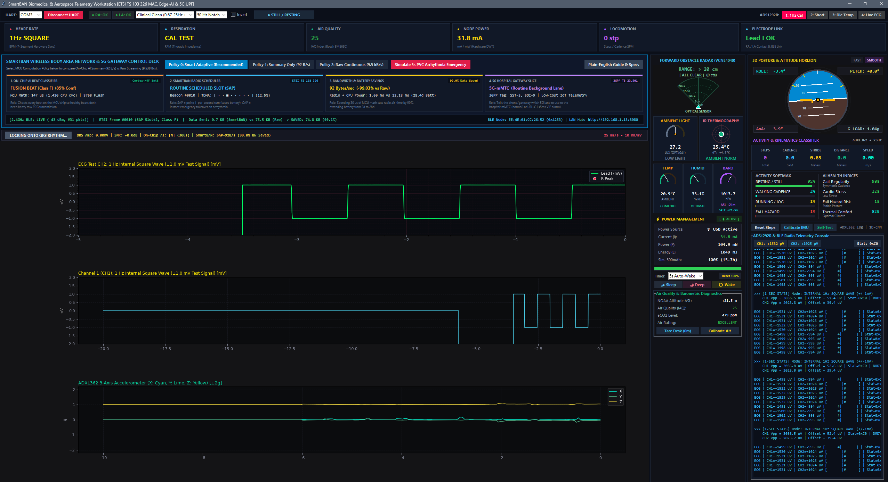
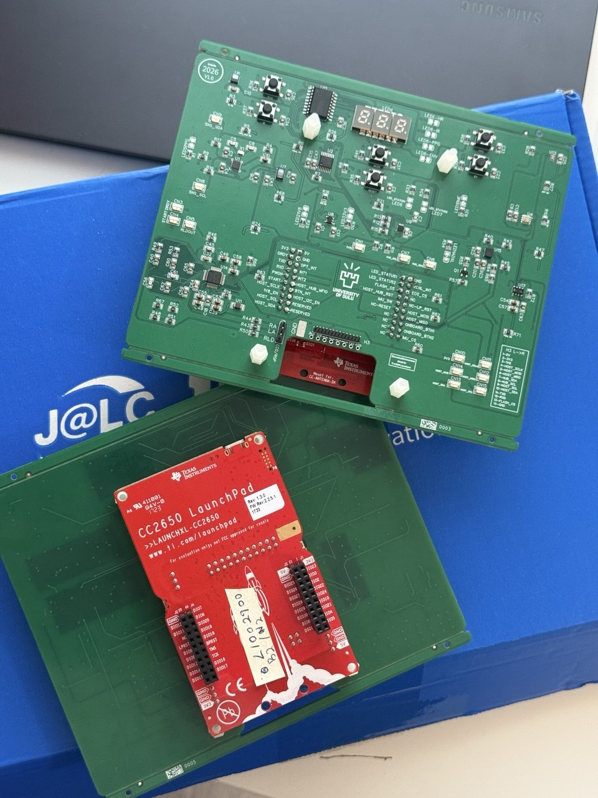
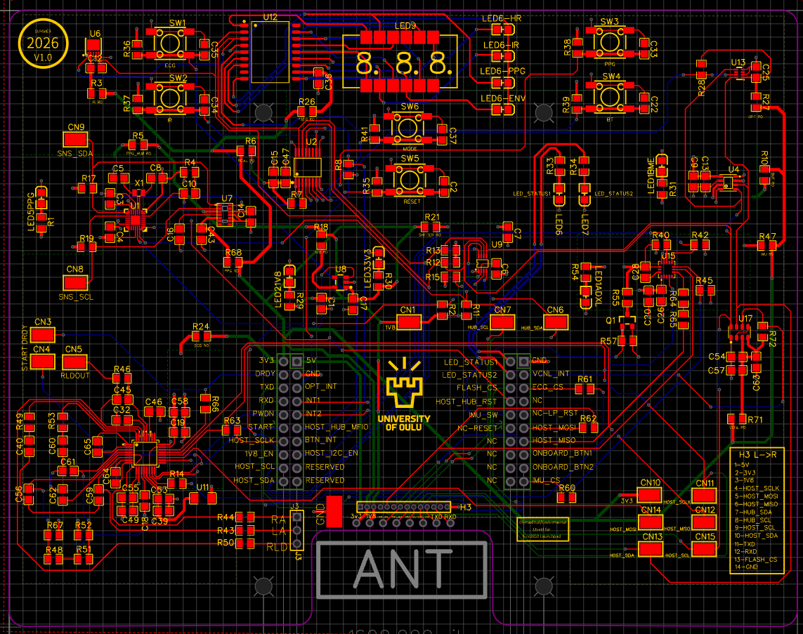

# SmartBAN Intelligent Wearable Sensor Node Firmware

[](LICENSE)
[](https://www.ti.com/tool/LAUNCHXL-CC26X2R1)
[]()
[]()
[]()

This repository contains the firmware and companion tools for a wearable SmartBAN (Smart Body Area Network) sensor node built on the Texas Instruments CC2652R1 LaunchPad and a custom multi-sensor shield.

The project brings together real-time physiological sensing (ECG), 3-axis motion tracking, environmental monitoring, on-chip machine learning for cardiac event detection, and wireless BLE telemetry with an Android companion application.

---

## 🖥️ Live Telemetry Desktop Workstation

Here is the real-time Python desktop visualizer running live with genuine hardware data over UART:



The workstation plots live 250 Hz biopotential waveforms, R-peak markers, 3-axis accelerometer dynamics, a 3D artificial horizon for posture tracking, environmental conditions (temperature, humidity, pressure, air quality), and live telemetry packets.

---

## 📱 Native Android Companion Application

The project includes a standalone native Android application (`android_app/`) that receives and displays live telemetry wirelessly over Bluetooth Low Energy:

- **Zero-Pairing Wireless Streaming**: Listens for 31-byte ETSI TS 103 326 SmartBAN advertising frames (`ADV_NONCONN_IND`) broadcast directly from the CC2652R1 antenna under manufacturer ID `0x53, 0x42` ("SB"). No Bluetooth pairing, PIN codes, or manual handshakes are needed.
- **Cardiac Electrophysiology**: Real-time heart rate (BPM), RR intervals, heart rate variability (HRV SDNN), and instantaneous visual arrhythmia warnings.
- **Edge-AI TinyML Beat Classifier**: Shows the real-time on-chip AAMI EC57 classification results (Normal [N], Premature Ventricular Contraction [V], Supraventricular [S], Fusion [F], Noise [Q]) executed directly on the microcontroller in 30 microseconds.
- **Biometrics and Environment**: Dual-source respiration rate (derived from thoracic impedance and ECG respiration), skin temperature, real-time posture classification (standing, sitting, supine, walking), and fall alerts.
- **SmartBAN TDMA and 5G Network Slicing**: Visualizes the 8-slot TDMA superframe (Scheduled Access S0 to S6 versus Contention Access CAP) and shows dynamic routing between high-efficiency 5G-mMTC (1 Hz, 99.03% bandwidth reduction) and low-latency 5G-URLLC (<1 ms emergency response).
- **Interactive Remote Simulation**: Includes an on-screen trigger to simulate a 5-second PVC arrhythmia event over the air, showing instant switching from 5G-mMTC to 5G-URLLC contention slots.
- **Ready to Install**: A pre-compiled APK (`SmartBAN_Monitor_v1.0.apk`) and a one-click automated USB installer script (`install_apk.bat`) are included in `android_app/`.

---

## 🔌 Hardware Setup

The system consists of a Texas Instruments CC2652R1 LaunchPad paired with a custom multi-sensor shield:

<p align="center">
  
  
</p>

### On-Board Sensors

- **ADS1292R** (Texas Instruments): 24-bit 2-channel low-power analog front-end for ECG and respiration pneumography.
- **ADXL362** (Analog Devices): Ultra-low-power 3-axis MEMS accelerometer with integrated autonomous motion detection.
- **BME680 / BME690** (Bosch Sensortec): Environmental sensor measuring gas resistance (VOC), barometric pressure, relative humidity, and ambient temperature.
- **MAX30102** (Analog Devices / Maxim Integrated): High-sensitivity optical pulse oximeter and heart-rate sensor.
- **MAX32664** (Analog Devices / Maxim Integrated): Ultra-low-power biometric sensor hub controller with embedded health algorithms.
- **VCNL4040** (Vishay): Integrated proximity sensor and high-precision ambient light sensor.
- **MLX90632** (Melexis): Medical-grade non-contact far-infrared (FIR) temperature sensor.
- **OPT4001 / OPT4041** (Texas Instruments): High-precision digital ambient light sensor.

### Power, Interface, and Control Components

- **CC2652R1 LaunchPad** (Texas Instruments): 48 MHz ARM Cortex-M4F microcontroller with 352 KB Flash, 80 KB RAM, and a multi-protocol 2.4 GHz radio.
- **TPAP2112K-1.8** (Tech Public): Ultra-low-noise 1.8V low-dropout (LDO) linear voltage regulator for analog rails.
- **PCA9306** (Texas Instruments): Dual bidirectional I2C and SMBus voltage-level translator.
- **CH455H** (WCH): 3/4-digit 7-segment LED display and keypad controller IC.
- **XL-SA2301SRWC**: 3-digit 7-segment numerical SMD LED display for on-board diagnostics.
- **Tactile Switches**: 6 push buttons for run-time modes (ECG test signals, optical modes, BT/tare, reset, and display mode cycle).
- **Status Indicator LEDs**: 11 surface-mount LEDs providing immediate visual feedback for power rails (3.3V, 1.8V), sensor states (ADS1292R heart rate lead, BME activity, ADXL motion, PPG pulse, IR channel), and system status.
- **ECG Lead Connector**: 3-pin terminal interface for Right Arm (RA), Left Arm (LA), and Right Leg Drive (RLD) electrode cables.

---

## 📁 Repository Guide

If you are new to the project, here is how the repository is structured:

```
├── 01_final_firmware_v12_stable/       # Flagship working version (v12 stable, start here!)
├── 02_dedicated_ecg_ads1292r/          # Standalone ADS1292R ECG bring-up with Python GUI
├── 03_ecg_leadless_test/               # Leadless electrode impedance and contact test
├── 04_dedicated_imu_adxl362/           # Standalone ADXL362 accelerometer test with 3D GUI
├── 05_all_in_one_baremetal/            # Multi-sensor integration on bare metal (No-RTOS)
├── 06_final_tirtos_all_in_one/         # Base TI-RTOS7 multi-tasking firmware
├── android_app/                        # Native Android telemetry app (Kotlin + Jetpack Compose + APK)
└── milestones_archive/                 # Earlier milestone builds (v01 to v11) and reference drivers
```

### 1. [01_final_firmware_v12_stable/](01_final_firmware_v12_stable/) (Recommended)
This is the main, fully working firmware. It runs on TI-RTOS7 and includes:
- **Live 250 Hz hardware ECG streaming**: True physical microvolt samples broadcast over BLE advertising frames.
- **On-chip TinyML neural network**: An 8-bit quantized classifier that identifies cardiac arrhythmia types (AAMI EC57 classes N, S, V, F, Q) in under 30 microseconds right on the microcontroller.
- **SmartBAN adaptive MAC**: An adaptive protocol (ETSI TS 103 326) that drops radio bandwidth by 99% during normal heart rhythms and bursts full data only when an irregular beat or fall occurs.
- **All sensors active**: Live ECG, IMU motion, and environmental data.
- **Companion tools**: Works directly with `sensor_gui.py` and the native Android app.

### 2. [02_dedicated_ecg_ads1292r/](02_dedicated_ecg_ads1292r/)
A clean, standalone firmware focused strictly on getting clean ECG from the ADS1292R. It handles 250 Hz DRDY interrupt sampling, internal reference settling, and real-time Pan-Tompkins QRS peak detection. Comes with its own desktop oscilloscope (`ecg_gui.py`).

### 3. [03_ecg_leadless_test/](03_ecg_leadless_test/)
A test firmware to check leadless dry-contact electrodes. It tests contact impedance and signal quality without using wet gel pads.

### 4. [04_dedicated_imu_adxl362/](04_dedicated_imu_adxl362/)
Dedicated firmware for the ADXL362 accelerometer over SPI Mode 0. It includes a boot calibration to zero out PCB mounting tilt, measures static gravity with 0.994 g accuracy, and includes an interactive 3D attitude visualizer (`gui_3d_imu.py`) plus a recorded demo video.

### 5. [05_all_in_one_baremetal/](05_all_in_one_baremetal/)
All sensors working together inside a simple bare-metal superloop (No-RTOS). Great for understanding the basic driver logic without RTOS task scheduling overhead.

### 6. [06_final_tirtos_all_in_one/](06_final_tirtos_all_in_one/)
The foundational TI-RTOS7 firmware. It sets up preemptive tasks, protects the shared SPI bus with a mutex (handling ADS1292R Mode 1 and ADXL362 Mode 0 without collisions), and passes samples through lock-free ring buffers.

### 7. [android_app/](android_app/)
The companion Android mobile app built with Kotlin and Jetpack Compose. Provides real-time over-the-air ECG viewing, TinyML classification status, and 5G network slicing metrics on your smartphone. Includes complete source code, Gradle build files, and a pre-compiled ready-to-run APK.

### 8. [milestones_archive/](milestones_archive/)
Contains all earlier iterative builds (v01 to v11), including initial pinout adjustments, PPG experiments, and test scripts. Preserved so you can trace how the system developed step by step.

---

## 🛠️ Building and Running in Code Composer Studio (CCS)

If you want to view, compile, or debug the C source code directly in Texas Instruments Code Composer Studio:

### Requirements
- **Code Composer Studio**: CCS version 12.x or CCS Theia.
- **Compiler Toolchain**: `tiarmclang` (version 5.1.1.LTS or compatible).
- **Software Development Kit**: SimpleLink CC13xx and CC26xx SDK version 8.33.x.
- **System Configuration Tool**: SysConfig 1.21.x or later (bundled with CCS).

### Step-by-Step CCS Workflow

1. **Open Code Composer Studio**:
   - Launch CCS and choose your preferred workspace directory.

2. **Import the Project**:
   - Go to **File -> Import...**
   - Expand **Code Composer Studio** and choose **CCS Projects**.
   - Click **Browse...** and select the firmware directory you want to run (for example, `01_final_firmware_v12_stable` or `06_final_tirtos_all_in_one`).
   - Check the discovered project box and click **Finish**.

3. **Build the Project**:
   - Select the project in the **Project Explorer** pane.
   - Click **Project -> Build Project** (or click the Hammer icon on the toolbar).
   - CCS will invoke `tiarmclang` and generate the binary output (`all_in_one.hex` and `.out`).

4. **Connect the Hardware**:
   - Connect the Texas Instruments CC2652R1 LaunchPad to your computer using a micro-USB cable.
   - The on-board XDS110 debugger will enumerate automatically.

5. **Flash and Debug**:
   - Click the green **Debug** icon (bug symbol) or press `F11`.
   - CCS will automatically connect to the on-board XDS110 debugger, erase the required flash pages, program the binary, and halt at the entry point of `main()`.
   - Press **Resume** (`F8`) to begin real-time firmware execution.

---

## ⚡ Quick Flash: No CCS Required

If you only want to flash and run the pre-built firmware without opening CCS:

### What You Need
1. TI CC2652R1 LaunchPad plugged in through USB.
2. Python 3.9+ with `pyserial`, `numpy`, and `pyqtgraph` (or `matplotlib`).
3. UniFlash or TI SmartRF Flash Programmer 2 (or run the provided Python script).

### Flash in One Step
Each project directory includes a pre-compiled `.hex` binary and a helper script:

```bash
cd 01_final_firmware_v12_stable
python build_and_flash.py
```

*Note: You can also open TI UniFlash, select CC2652R1, and flash `all_in_one.hex` directly.*

### Launch the Desktop GUI
Find your LaunchPad serial port (for example, `COM3` on Windows) and run:

```bash
cd 01_final_firmware_v12_stable
python sensor_gui.py --port COM3 --baud 115200
```

### Install the Android Mobile App
To install the Android application on your smartphone:
1. Connect your Android phone to your PC via USB with USB Debugging enabled.
2. In the `android_app` directory, run:
   ```cmd
   install_apk.bat
   ```
3. Alternatively, copy `SmartBAN_Monitor_v1.0.apk` directly to your phone and tap to install.

---

## 📄 License
This project is licensed under the [MIT License](LICENSE).
